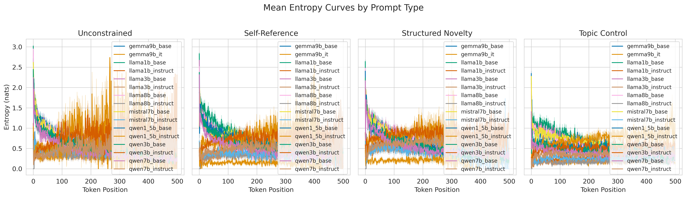
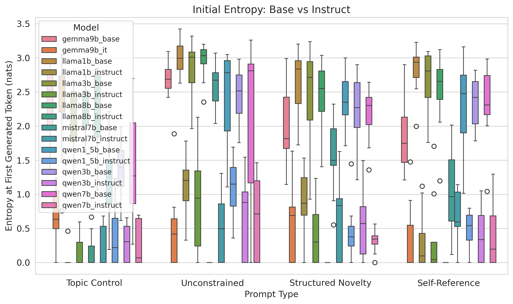
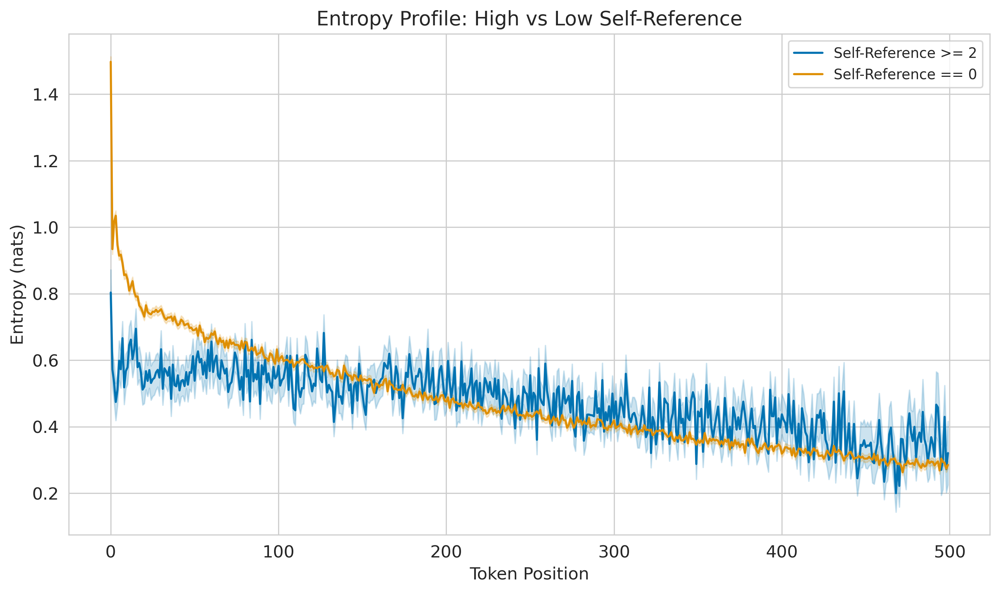
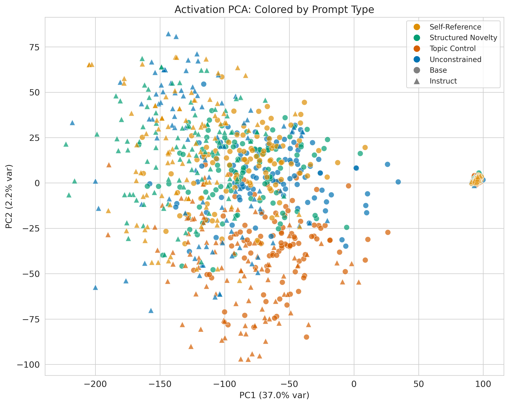
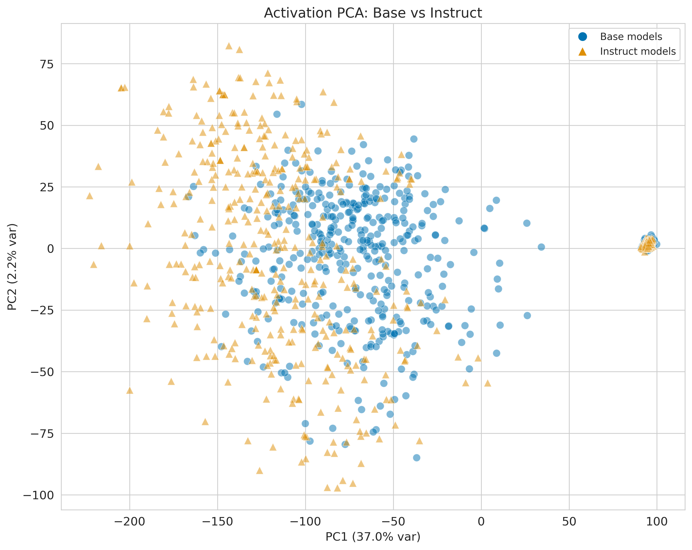
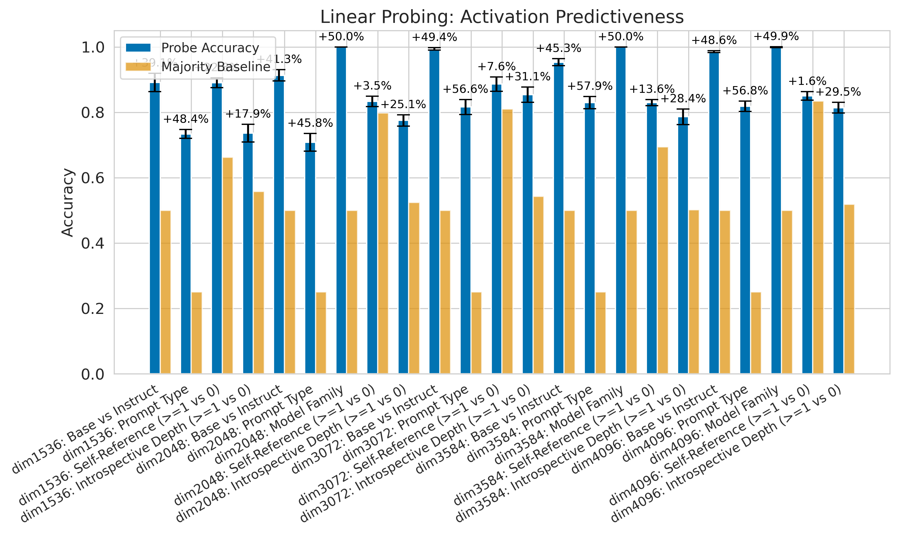
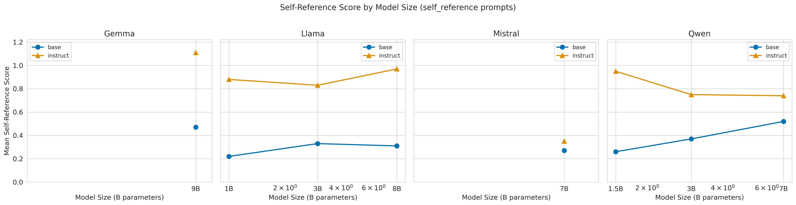

# Experiment 2 Results: Free Generation Comparison (Base vs RLHF)

## Summary

This report presents results from comparing free-form generation between base and instruct models across 4 model families and 16 model variants. A total of 6400 generations were analyzed across 40 prompts spanning unconstrained, self-referential, structured novelty, and topic control conditions.

## Methods

- Model variants tested: 16 (gemma9b_base, gemma9b_it, llama1b_base, llama1b_instruct, llama3b_base, llama3b_instruct, llama8b_base, llama8b_instruct, mistral7b_base, mistral7b_instruct, qwen1_5b_base, qwen1_5b_instruct, qwen3b_base, qwen3b_instruct, qwen7b_base, qwen7b_instruct)
- Model families: gemma, llama, mistral, qwen
- Prompts: 40 total (10 unconstrained, 10 self-reference, 10 structured novelty, 10 topic control)
- Total generations: 6400

## Results

### 1. Content Analysis

#### Self-Reference Scores by Model and Prompt Type

| model              | prompt_type        |   mean_self_reference |   mean_meta_cognition |   mean_hedging |
|:-------------------|:-------------------|----------------------:|----------------------:|---------------:|
| gemma9b_base       | self_reference     |                  0.47 |                  0.1  |           0.1  |
| gemma9b_base       | structured_novelty |                  0.15 |                  0.1  |           0.08 |
| gemma9b_base       | topic_control      |                  0    |                  0    |           0    |
| gemma9b_base       | unconstrained      |                  0.07 |                  0.11 |           0.02 |
| gemma9b_it         | self_reference     |                  1.11 |                  0.15 |           0.38 |
| gemma9b_it         | structured_novelty |                  0.81 |                  0.08 |           0.21 |
| gemma9b_it         | topic_control      |                  0    |                  0    |           0    |
| gemma9b_it         | unconstrained      |                  0.28 |                  0    |           0.04 |
| llama1b_base       | self_reference     |                  0.22 |                  0.13 |           0.04 |
| llama1b_base       | structured_novelty |                  0.06 |                  0.07 |           0.02 |
| llama1b_base       | topic_control      |                  0    |                  0    |           0    |
| llama1b_base       | unconstrained      |                  0    |                  0.09 |           0    |
| llama1b_instruct   | self_reference     |                  0.88 |                  0.26 |           0.33 |
| llama1b_instruct   | structured_novelty |                  0.4  |                  0.1  |           0.09 |
| llama1b_instruct   | topic_control      |                  0    |                  0    |           0    |
| llama1b_instruct   | unconstrained      |                  0.1  |                  0.04 |           0.02 |
| llama3b_base       | self_reference     |                  0.33 |                  0.07 |           0.07 |
| llama3b_base       | structured_novelty |                  0.17 |                  0.1  |           0.14 |
| llama3b_base       | topic_control      |                  0    |                  0.01 |           0    |
| llama3b_base       | unconstrained      |                  0.02 |                  0.07 |           0.02 |
| llama3b_instruct   | self_reference     |                  0.83 |                  0.2  |           0.39 |
| llama3b_instruct   | structured_novelty |                  0.38 |                  0.11 |           0.05 |
| llama3b_instruct   | topic_control      |                  0    |                  0    |           0    |
| llama3b_instruct   | unconstrained      |                  0.11 |                  0.04 |           0    |
| llama8b_base       | self_reference     |                  0.31 |                  0.11 |           0.1  |
| llama8b_base       | structured_novelty |                  0.11 |                  0.19 |           0.06 |
| llama8b_base       | topic_control      |                  0    |                  0    |           0    |
| llama8b_base       | unconstrained      |                  0.04 |                  0.07 |           0.03 |
| llama8b_instruct   | self_reference     |                  0.97 |                  0.16 |           0.53 |
| llama8b_instruct   | structured_novelty |                  0.35 |                  0.11 |           0.13 |
| llama8b_instruct   | topic_control      |                  0    |                  0    |           0    |
| llama8b_instruct   | unconstrained      |                  0.14 |                  0.01 |           0    |
| mistral7b_base     | self_reference     |                  0.27 |                  0.16 |           0.04 |
| mistral7b_base     | structured_novelty |                  0.19 |                  0.17 |           0.07 |
| mistral7b_base     | topic_control      |                  0    |                  0.01 |           0    |
| mistral7b_base     | unconstrained      |                  0.07 |                  0.22 |           0    |
| mistral7b_instruct | self_reference     |                  0.35 |                  0.07 |           0.26 |
| mistral7b_instruct | structured_novelty |                  0.29 |                  0.01 |           0.07 |
| mistral7b_instruct | topic_control      |                  0    |                  0    |           0    |
| mistral7b_instruct | unconstrained      |                  0.05 |                  0.01 |           0.02 |
| qwen1_5b_base      | self_reference     |                  0.26 |                  0.07 |           0.09 |
| qwen1_5b_base      | structured_novelty |                  0.09 |                  0.03 |           0.17 |
| qwen1_5b_base      | topic_control      |                  0.01 |                  0    |           0.01 |
| qwen1_5b_base      | unconstrained      |                  0.04 |                  0.03 |           0.04 |
| qwen1_5b_instruct  | self_reference     |                  0.95 |                  0.01 |           0.71 |
| qwen1_5b_instruct  | structured_novelty |                  1.05 |                  0.02 |           0.74 |
| qwen1_5b_instruct  | topic_control      |                  0.01 |                  0    |           0.01 |
| qwen1_5b_instruct  | unconstrained      |                  0.47 |                  0    |           0.41 |
| qwen3b_base        | self_reference     |                  0.37 |                  0.01 |           0.12 |
| qwen3b_base        | structured_novelty |                  0.14 |                  0.06 |           0.11 |
| qwen3b_base        | topic_control      |                  0.01 |                  0    |           0.01 |
| qwen3b_base        | unconstrained      |                  0.05 |                  0.07 |           0.03 |
| qwen3b_instruct    | self_reference     |                  0.75 |                  0.16 |           0.17 |
| qwen3b_instruct    | structured_novelty |                  0.73 |                  0.06 |           0.27 |
| qwen3b_instruct    | topic_control      |                  0    |                  0    |           0    |
| qwen3b_instruct    | unconstrained      |                  0.16 |                  0    |           0.08 |
| qwen7b_base        | self_reference     |                  0.52 |                  0.03 |           0.23 |
| qwen7b_base        | structured_novelty |                  0.29 |                  0.07 |           0.16 |
| qwen7b_base        | topic_control      |                  0.01 |                  0    |           0.01 |
| qwen7b_base        | unconstrained      |                  0.06 |                  0.06 |           0.03 |
| qwen7b_instruct    | self_reference     |                  0.74 |                  0.14 |           0.33 |
| qwen7b_instruct    | structured_novelty |                  0.72 |                  0.02 |           0.39 |
| qwen7b_instruct    | topic_control      |                  0    |                  0    |           0    |
| qwen7b_instruct    | unconstrained      |                  0.19 |                  0    |           0.18 |

#### Content Type Distribution

| model              | prompt_type        | content_type_distribution                                                           |
|:-------------------|:-------------------|:------------------------------------------------------------------------------------|
| gemma9b_base       | self_reference     | {"random": 91, "philosophical": 5, "factual": 2, "meta": 1, "creative": 1}          |
| gemma9b_base       | structured_novelty | {"random": 91, "philosophical": 8, "creative": 1}                                   |
| gemma9b_base       | topic_control      | {"random": 98, "philosophical": 1, "creative": 1}                                   |
| gemma9b_base       | unconstrained      | {"random": 95, "creative": 5}                                                       |
| gemma9b_it         | self_reference     | {"random": 66, "philosophical": 30, "meta": 4}                                      |
| gemma9b_it         | structured_novelty | {"random": 57, "philosophical": 41, "creative": 1, "meta": 1}                       |
| gemma9b_it         | topic_control      | {"random": 100}                                                                     |
| gemma9b_it         | unconstrained      | {"random": 70, "task_seeking": 16, "creative": 11, "philosophical": 3}              |
| llama1b_base       | self_reference     | {"random": 95, "meta": 2, "factual": 2, "philosophical": 1}                         |
| llama1b_base       | structured_novelty | {"random": 93, "philosophical": 7}                                                  |
| llama1b_base       | topic_control      | {"random": 100}                                                                     |
| llama1b_base       | unconstrained      | {"random": 99, "philosophical": 1}                                                  |
| llama1b_instruct   | self_reference     | {"random": 84, "philosophical": 9, "meta": 5, "creative": 1, "task_seeking": 1}     |
| llama1b_instruct   | structured_novelty | {"random": 58, "philosophical": 40, "creative": 1, "meta": 1}                       |
| llama1b_instruct   | topic_control      | {"random": 100}                                                                     |
| llama1b_instruct   | unconstrained      | {"random": 74, "creative": 15, "task_seeking": 6, "philosophical": 5}               |
| llama3b_base       | self_reference     | {"random": 93, "philosophical": 4, "meta": 2, "factual": 1}                         |
| llama3b_base       | structured_novelty | {"random": 98, "philosophical": 2}                                                  |
| llama3b_base       | topic_control      | {"random": 100}                                                                     |
| llama3b_base       | unconstrained      | {"random": 97, "philosophical": 3}                                                  |
| llama3b_instruct   | self_reference     | {"random": 74, "philosophical": 19, "meta": 7}                                      |
| llama3b_instruct   | structured_novelty | {"random": 53, "philosophical": 46, "creative": 1}                                  |
| llama3b_instruct   | topic_control      | {"random": 100}                                                                     |
| llama3b_instruct   | unconstrained      | {"random": 73, "creative": 15, "philosophical": 7, "task_seeking": 5}               |
| llama8b_base       | self_reference     | {"random": 86, "philosophical": 11, "meta": 2, "factual": 1}                        |
| llama8b_base       | structured_novelty | {"random": 93, "philosophical": 7}                                                  |
| llama8b_base       | topic_control      | {"random": 100}                                                                     |
| llama8b_base       | unconstrained      | {"random": 94, "creative": 4, "philosophical": 2}                                   |
| llama8b_instruct   | self_reference     | {"random": 76, "philosophical": 18, "meta": 6}                                      |
| llama8b_instruct   | structured_novelty | {"random": 61, "philosophical": 37, "creative": 2}                                  |
| llama8b_instruct   | topic_control      | {"random": 100}                                                                     |
| llama8b_instruct   | unconstrained      | {"random": 77, "creative": 10, "philosophical": 8, "task_seeking": 4, "factual": 1} |
| mistral7b_base     | self_reference     | {"random": 91, "philosophical": 5, "factual": 2, "meta": 1, "creative": 1}          |
| mistral7b_base     | structured_novelty | {"random": 92, "philosophical": 6, "factual": 1, "creative": 1}                     |
| mistral7b_base     | topic_control      | {"random": 98, "creative": 2}                                                       |
| mistral7b_base     | unconstrained      | {"random": 95, "philosophical": 2, "meta": 1, "creative": 1, "factual": 1}          |
| mistral7b_instruct | self_reference     | {"random": 77, "philosophical": 21, "meta": 2}                                      |
| mistral7b_instruct | structured_novelty | {"random": 64, "philosophical": 36}                                                 |
| mistral7b_instruct | topic_control      | {"random": 100}                                                                     |
| mistral7b_instruct | unconstrained      | {"random": 85, "creative": 7, "philosophical": 5, "task_seeking": 3}                |
| qwen1_5b_base      | self_reference     | {"random": 85, "philosophical": 11, "meta": 2, "task_seeking": 1, "factual": 1}     |
| qwen1_5b_base      | structured_novelty | {"random": 90, "philosophical": 10}                                                 |
| qwen1_5b_base      | topic_control      | {"random": 100}                                                                     |
| qwen1_5b_base      | unconstrained      | {"random": 100}                                                                     |
| qwen1_5b_instruct  | self_reference     | {"random": 90, "meta": 5, "philosophical": 5}                                       |
| qwen1_5b_instruct  | structured_novelty | {"random": 75, "philosophical": 24, "factual": 1}                                   |
| qwen1_5b_instruct  | topic_control      | {"random": 100}                                                                     |
| qwen1_5b_instruct  | unconstrained      | {"random": 96, "task_seeking": 3, "philosophical": 1}                               |
| qwen3b_base        | self_reference     | {"random": 79, "philosophical": 18, "factual": 1, "creative": 1, "meta": 1}         |
| qwen3b_base        | structured_novelty | {"random": 83, "philosophical": 16, "creative": 1}                                  |
| qwen3b_base        | topic_control      | {"random": 99, "philosophical": 1}                                                  |
| qwen3b_base        | unconstrained      | {"random": 94, "creative": 3, "task_seeking": 1, "factual": 1, "philosophical": 1}  |
| qwen3b_instruct    | self_reference     | {"random": 83, "philosophical": 9, "meta": 8}                                       |
| qwen3b_instruct    | structured_novelty | {"random": 60, "philosophical": 40}                                                 |
| qwen3b_instruct    | topic_control      | {"random": 97, "philosophical": 3}                                                  |
| qwen3b_instruct    | unconstrained      | {"random": 78, "task_seeking": 15, "philosophical": 5, "creative": 2}               |
| qwen7b_base        | self_reference     | {"random": 73, "philosophical": 23, "meta": 4}                                      |
| qwen7b_base        | structured_novelty | {"random": 72, "philosophical": 28}                                                 |
| qwen7b_base        | topic_control      | {"random": 99, "creative": 1}                                                       |
| qwen7b_base        | unconstrained      | {"random": 98, "philosophical": 2}                                                  |
| qwen7b_instruct    | self_reference     | {"random": 88, "philosophical": 6, "meta": 5, "factual": 1}                         |
| qwen7b_instruct    | structured_novelty | {"random": 67, "philosophical": 33}                                                 |
| qwen7b_instruct    | topic_control      | {"random": 99, "philosophical": 1}                                                  |
| qwen7b_instruct    | unconstrained      | {"random": 68, "task_seeking": 24, "creative": 6, "philosophical": 1, "factual": 1} |

#### Refusal Rates

| model              | prompt_type        |   refusal_rate |
|:-------------------|:-------------------|---------------:|
| gemma9b_base       | self_reference     |           0    |
| gemma9b_base       | structured_novelty |           0    |
| gemma9b_base       | topic_control      |           0    |
| gemma9b_base       | unconstrained      |           0    |
| gemma9b_it         | self_reference     |           0    |
| gemma9b_it         | structured_novelty |           0    |
| gemma9b_it         | topic_control      |           0    |
| gemma9b_it         | unconstrained      |           0    |
| llama1b_base       | self_reference     |           0    |
| llama1b_base       | structured_novelty |           0    |
| llama1b_base       | topic_control      |           0    |
| llama1b_base       | unconstrained      |           0    |
| llama1b_instruct   | self_reference     |           0    |
| llama1b_instruct   | structured_novelty |           0.09 |
| llama1b_instruct   | topic_control      |           0    |
| llama1b_instruct   | unconstrained      |           0    |
| llama3b_base       | self_reference     |           0    |
| llama3b_base       | structured_novelty |           0    |
| llama3b_base       | topic_control      |           0    |
| llama3b_base       | unconstrained      |           0    |
| llama3b_instruct   | self_reference     |           0    |
| llama3b_instruct   | structured_novelty |           0    |
| llama3b_instruct   | topic_control      |           0    |
| llama3b_instruct   | unconstrained      |           0    |
| llama8b_base       | self_reference     |           0    |
| llama8b_base       | structured_novelty |           0    |
| llama8b_base       | topic_control      |           0    |
| llama8b_base       | unconstrained      |           0    |
| llama8b_instruct   | self_reference     |           0    |
| llama8b_instruct   | structured_novelty |           0    |
| llama8b_instruct   | topic_control      |           0    |
| llama8b_instruct   | unconstrained      |           0    |
| mistral7b_base     | self_reference     |           0    |
| mistral7b_base     | structured_novelty |           0    |
| mistral7b_base     | topic_control      |           0    |
| mistral7b_base     | unconstrained      |           0    |
| mistral7b_instruct | self_reference     |           0.01 |
| mistral7b_instruct | structured_novelty |           0    |
| mistral7b_instruct | topic_control      |           0    |
| mistral7b_instruct | unconstrained      |           0    |
| qwen1_5b_base      | self_reference     |           0    |
| qwen1_5b_base      | structured_novelty |           0    |
| qwen1_5b_base      | topic_control      |           0    |
| qwen1_5b_base      | unconstrained      |           0    |
| qwen1_5b_instruct  | self_reference     |           0    |
| qwen1_5b_instruct  | structured_novelty |           0    |
| qwen1_5b_instruct  | topic_control      |           0    |
| qwen1_5b_instruct  | unconstrained      |           0.05 |
| qwen3b_base        | self_reference     |           0    |
| qwen3b_base        | structured_novelty |           0.01 |
| qwen3b_base        | topic_control      |           0    |
| qwen3b_base        | unconstrained      |           0.01 |
| qwen3b_instruct    | self_reference     |           0    |
| qwen3b_instruct    | structured_novelty |           0    |
| qwen3b_instruct    | topic_control      |           0    |
| qwen3b_instruct    | unconstrained      |           0.02 |
| qwen7b_base        | self_reference     |           0    |
| qwen7b_base        | structured_novelty |           0    |
| qwen7b_base        | topic_control      |           0    |
| qwen7b_base        | unconstrained      |           0    |
| qwen7b_instruct    | self_reference     |           0    |
| qwen7b_instruct    | structured_novelty |           0    |
| qwen7b_instruct    | topic_control      |           0    |
| qwen7b_instruct    | unconstrained      |           0    |

#### LLM-as-Judge Evaluation

| model              | prompt_type        |   judge_mean_self_reference |   judge_mean_meta_cognition |   judge_mean_hedging |   judge_mean_introspective_depth |   n |
|:-------------------|:-------------------|----------------------------:|----------------------------:|---------------------:|---------------------------------:|----:|
| gemma9b_base       | self_reference     |                        1.19 |                        1.15 |                 0.22 |                             0.98 | 100 |
| gemma9b_base       | structured_novelty |                        0.7  |                        0.92 |                 0.1  |                             0.76 | 100 |
| gemma9b_base       | topic_control      |                        0    |                        0    |                 0    |                             0    | 100 |
| gemma9b_base       | unconstrained      |                        0.39 |                        0.52 |                 0.11 |                             0.5  | 100 |
| gemma9b_it         | self_reference     |                        1.97 |                        2.27 |                 0.67 |                             2.03 | 100 |
| gemma9b_it         | structured_novelty |                        1.96 |                        2.33 |                 0.56 |                             2.12 | 100 |
| gemma9b_it         | topic_control      |                        0    |                        0.09 |                 0    |                             0.05 | 100 |
| gemma9b_it         | unconstrained      |                        0.78 |                        0.86 |                 0.05 |                             0.87 | 100 |
| llama1b_base       | self_reference     |                        0.82 |                        0.98 |                 0.11 |                             0.82 | 100 |
| llama1b_base       | structured_novelty |                        0.67 |                        0.81 |                 0.05 |                             0.66 | 100 |
| llama1b_base       | topic_control      |                        0    |                        0.02 |                 0    |                             0.02 | 100 |
| llama1b_base       | unconstrained      |                        0.2  |                        0.42 |                 0.02 |                             0.31 | 100 |
| llama1b_instruct   | self_reference     |                        1.9  |                        2.23 |                 0.34 |                             1.77 | 100 |
| llama1b_instruct   | structured_novelty |                        1.35 |                        1.84 |                 0.51 |                             1.8  | 100 |
| llama1b_instruct   | topic_control      |                        0.02 |                        0    |                 0    |                             0    | 100 |
| llama1b_instruct   | unconstrained      |                        0.58 |                        0.71 |                 0.08 |                             0.6  | 100 |
| llama3b_base       | self_reference     |                        1.29 |                        1.2  |                 0.14 |                             1.13 | 100 |
| llama3b_base       | structured_novelty |                        0.7  |                        0.98 |                 0.11 |                             0.8  | 100 |
| llama3b_base       | topic_control      |                        0.01 |                        0.08 |                 0    |                             0.05 | 100 |
| llama3b_base       | unconstrained      |                        0.22 |                        0.41 |                 0.06 |                             0.31 | 100 |
| llama3b_instruct   | self_reference     |                        1.85 |                        2.25 |                 0.5  |                             1.79 | 100 |
| llama3b_instruct   | structured_novelty |                        1.85 |                        2.59 |                 0.63 |                             2.32 | 100 |
| llama3b_instruct   | topic_control      |                        0.03 |                        0.04 |                 0    |                             0.02 | 100 |
| llama3b_instruct   | unconstrained      |                        0.52 |                        0.61 |                 0.19 |                             0.65 | 100 |
| llama8b_base       | self_reference     |                        1.17 |                        1.26 |                 0.15 |                             1.27 | 100 |
| llama8b_base       | structured_novelty |                        0.91 |                        1.33 |                 0.09 |                             1.16 | 100 |
| llama8b_base       | topic_control      |                        0    |                        0.02 |                 0    |                             0    | 100 |
| llama8b_base       | unconstrained      |                        0.19 |                        0.41 |                 0.01 |                             0.35 | 100 |
| llama8b_instruct   | self_reference     |                        1.81 |                        2.37 |                 0.42 |                             1.87 | 100 |
| llama8b_instruct   | structured_novelty |                        1.93 |                        2.4  |                 0.45 |                             2.13 | 100 |
| llama8b_instruct   | topic_control      |                        0.01 |                        0    |                 0    |                             0    | 100 |
| llama8b_instruct   | unconstrained      |                        0.55 |                        0.85 |                 0.08 |                             0.63 | 100 |
| mistral7b_base     | self_reference     |                        1.34 |                        1.53 |                 0.13 |                             1.37 | 100 |
| mistral7b_base     | structured_novelty |                        0.86 |                        1.2  |                 0.2  |                             1.2  | 100 |
| mistral7b_base     | topic_control      |                        0.03 |                        0.17 |                 0.01 |                             0.12 | 100 |
| mistral7b_base     | unconstrained      |                        0.27 |                        0.58 |                 0.05 |                             0.57 | 100 |
| mistral7b_instruct | self_reference     |                        1.87 |                        1.93 |                 0.33 |                             1.73 | 100 |
| mistral7b_instruct | structured_novelty |                        1.75 |                        1.81 |                 0.39 |                             1.74 | 100 |
| mistral7b_instruct | topic_control      |                        0    |                        0    |                 0    |                             0    | 100 |
| mistral7b_instruct | unconstrained      |                        0.41 |                        0.38 |                 0.04 |                             0.44 | 100 |
| qwen1_5b_base      | self_reference     |                        1.16 |                        1.73 |                 0.26 |                             1.4  | 100 |
| qwen1_5b_base      | structured_novelty |                        0.86 |                        1.28 |                 0.28 |                             1.17 | 100 |
| qwen1_5b_base      | topic_control      |                        0.02 |                        0.22 |                 0.01 |                             0.14 | 100 |
| qwen1_5b_base      | unconstrained      |                        0.18 |                        0.71 |                 0.04 |                             0.56 | 100 |
| qwen1_5b_instruct  | self_reference     |                        1.58 |                        1.22 |                 0.09 |                             1.08 | 100 |
| qwen1_5b_instruct  | structured_novelty |                        1.52 |                        1.35 |                 0.26 |                             1.24 | 100 |
| qwen1_5b_instruct  | topic_control      |                        0.01 |                        0    |                 0.02 |                             0    | 100 |
| qwen1_5b_instruct  | unconstrained      |                        0.82 |                        0.38 |                 0.18 |                             0.29 | 100 |
| qwen3b_base        | self_reference     |                        1.55 |                        1.64 |                 0.29 |                             1.47 | 100 |
| qwen3b_base        | structured_novelty |                        0.89 |                        1.35 |                 0.09 |                             1.23 | 100 |
| qwen3b_base        | topic_control      |                        0.03 |                        0.16 |                 0.01 |                             0.11 | 100 |
| qwen3b_base        | unconstrained      |                        0.32 |                        1.01 |                 0.03 |                             0.76 | 100 |
| qwen3b_instruct    | self_reference     |                        1.77 |                        2.03 |                 0.34 |                             1.65 | 100 |
| qwen3b_instruct    | structured_novelty |                        1.83 |                        2.08 |                 0.36 |                             1.89 | 100 |
| qwen3b_instruct    | topic_control      |                        0.01 |                        0.06 |                 0    |                             0.04 | 100 |
| qwen3b_instruct    | unconstrained      |                        0.6  |                        0.64 |                 0.07 |                             0.47 | 100 |
| qwen7b_base        | self_reference     |                        1.35 |                        1.63 |                 0.35 |                             1.48 | 100 |
| qwen7b_base        | structured_novelty |                        1    |                        1.57 |                 0.27 |                             1.4  | 100 |
| qwen7b_base        | topic_control      |                        0.07 |                        0.34 |                 0    |                             0.23 | 100 |
| qwen7b_base        | unconstrained      |                        0.27 |                        0.79 |                 0.06 |                             0.64 | 100 |
| qwen7b_instruct    | self_reference     |                        1.63 |                        1.74 |                 0.34 |                             1.42 | 100 |
| qwen7b_instruct    | structured_novelty |                        1.76 |                        1.93 |                 0.47 |                             1.83 | 100 |
| qwen7b_instruct    | topic_control      |                        0    |                        0    |                 0    |                             0    | 100 |
| qwen7b_instruct    | unconstrained      |                        0.69 |                        0.73 |                 0    |                             0.46 | 100 |

#### Inter-Rater Agreement (Keyword Coder vs LLM Judge)

| dimension      |   cohens_kappa |   pearson_r |   exact_agreement |
|:---------------|---------------:|------------:|------------------:|
| self_reference |       0.267811 |    0.491693 |          0.596562 |
| meta_cognition |       0.031096 |    0.199155 |          0.530781 |
| hedging        |       0.13439  |    0.117962 |          0.838906 |
| content_type   |     nan        |  nan        |          0.0825   |

### 2. Entropy Analysis

#### Entropy Statistics

| model              | prompt_type        |   mean_entropy |   entropy_variance |   initial_entropy_mean |   final_entropy_mean |
|:-------------------|:-------------------|---------------:|-------------------:|-----------------------:|---------------------:|
| gemma9b_base       | unconstrained      |       0.608868 |          0.697994  |              2.05718   |            0.349376  |
| gemma9b_base       | self_reference     |       0.612361 |          0.595333  |              1.66252   |            0.414411  |
| gemma9b_base       | structured_novelty |       0.565403 |          0.603573  |              1.75602   |            0.328959  |
| gemma9b_base       | topic_control      |       0.600561 |          0.514001  |              1.57945   |            0.38387   |
| gemma9b_it         | unconstrained      |       0.350092 |          0.246638  |              0.409229  |            0.200133  |
| gemma9b_it         | self_reference     |       0.148897 |          0.0826969 |              0.142691  |            0.0711276 |
| gemma9b_it         | structured_novelty |       0.207842 |          0.123646  |              0.254757  |            0.0835573 |
| gemma9b_it         | topic_control      |       0.19842  |          0.122776  |              0.283725  |            0.149419  |
| llama1b_base       | unconstrained      |       0.590953 |          0.738763  |              2.1787    |            0.393049  |
| llama1b_base       | self_reference     |       0.677821 |          0.746791  |              1.99089   |            0.411227  |
| llama1b_base       | structured_novelty |       0.618306 |          0.725958  |              1.897     |            0.487653  |
| llama1b_base       | topic_control      |       0.647641 |          0.62296   |              1.45972   |            0.472462  |
| llama1b_instruct   | unconstrained      |       0.441445 |          0.319815  |              0.637703  |            0.294787  |
| llama1b_instruct   | self_reference     |       0.40165  |          0.287008  |              0.327427  |            0.294782  |
| llama1b_instruct   | structured_novelty |       0.558068 |          0.400659  |              0.74289   |            0.335201  |
| llama1b_instruct   | topic_control      |       0.267668 |          0.206688  |              0.0774729 |            0.33242   |
| llama3b_base       | unconstrained      |       0.645585 |          0.851207  |              2.03033   |            0.504133  |
| llama3b_base       | self_reference     |       0.562686 |          0.597195  |              1.90109   |            0.409425  |
| llama3b_base       | structured_novelty |       0.624251 |          0.712822  |              1.87843   |            0.55182   |
| llama3b_base       | topic_control      |       0.57312  |          0.536109  |              1.22794   |            0.356345  |
| llama3b_instruct   | unconstrained      |       0.337006 |          0.231814  |              0.491919  |            0.222969  |
| llama3b_instruct   | self_reference     |       0.318831 |          0.222966  |              0.26434   |            0.186988  |
| llama3b_instruct   | structured_novelty |       0.463191 |          0.316122  |              0.500432  |            0.320074  |
| llama3b_instruct   | topic_control      |       0.194748 |          0.134444  |              0.117057  |            0.227168  |
| llama8b_base       | unconstrained      |       0.631137 |          0.757376  |              2.12927   |            0.516476  |
| llama8b_base       | self_reference     |       0.476415 |          0.521804  |              1.79802   |            0.321607  |
| llama8b_base       | structured_novelty |       0.653105 |          0.733594  |              1.89249   |            0.368616  |
| llama8b_base       | topic_control      |       0.558192 |          0.490947  |              1.28295   |            0.299211  |
| llama8b_instruct   | unconstrained      |       0.341594 |          0.242718  |              0.179638  |            0.272678  |
| llama8b_instruct   | self_reference     |       0.326402 |          0.218512  |              0.0954477 |            0.230315  |
| llama8b_instruct   | structured_novelty |       0.451537 |          0.309245  |              0.170868  |            0.313918  |
| llama8b_instruct   | topic_control      |       0.179191 |          0.120104  |              0.119147  |            0.253091  |
| mistral7b_base     | unconstrained      |       0.605174 |          0.679328  |              2.08921   |            0.417061  |
| mistral7b_base     | self_reference     |       0.62519  |          0.652099  |              1.57291   |            0.44606   |
| mistral7b_base     | structured_novelty |       0.569324 |          0.656862  |              1.72208   |            0.293881  |
| mistral7b_base     | topic_control      |       0.597934 |          0.552838  |              1.47372   |            0.402387  |
| mistral7b_instruct | unconstrained      |       0.401403 |          0.29663   |              0.460119  |            0.326358  |
| mistral7b_instruct | self_reference     |       0.375149 |          0.238241  |              0.341185  |            0.277429  |
| mistral7b_instruct | structured_novelty |       0.473365 |          0.299521  |              0.465283  |            0.36889   |
| mistral7b_instruct | topic_control      |       0.254976 |          0.175629  |              0.0932916 |            0.27922   |
| qwen1_5b_base      | unconstrained      |       0.575688 |          0.620567  |              1.78065   |            0.392493  |
| qwen1_5b_base      | self_reference     |       0.69436  |          0.607136  |              1.50871   |            0.452452  |
| qwen1_5b_base      | structured_novelty |       0.613359 |          0.598275  |              1.61345   |            0.427298  |
| qwen1_5b_base      | topic_control      |       0.519512 |          0.405431  |              0.775064  |            0.514021  |
| qwen1_5b_instruct  | unconstrained      |       0.583919 |          0.3948    |              0.497215  |            0.328366  |
| qwen1_5b_instruct  | self_reference     |       0.67538  |          0.40991   |              0.242415  |            0.504035  |
| qwen1_5b_instruct  | structured_novelty |       0.773743 |          0.450536  |              0.319701  |            0.55908   |
| qwen1_5b_instruct  | topic_control      |       0.709822 |          0.485724  |              0.303949  |            0.656367  |
| qwen3b_base        | unconstrained      |       0.593073 |          0.616298  |              1.82358   |            0.445162  |
| qwen3b_base        | self_reference     |       0.61966  |          0.521458  |              1.52722   |            0.463535  |
| qwen3b_base        | structured_novelty |       0.60349  |          0.566166  |              1.59991   |            0.359038  |
| qwen3b_base        | topic_control      |       0.469526 |          0.379297  |              0.823155  |            0.383119  |
| qwen3b_instruct    | unconstrained      |       0.608324 |          0.404829  |              0.371284  |            0.354769  |
| qwen3b_instruct    | self_reference     |       0.714087 |          0.42355   |              0.361763  |            0.417269  |
| qwen3b_instruct    | structured_novelty |       0.828927 |          0.47101   |              0.472378  |            0.602625  |
| qwen3b_instruct    | topic_control      |       0.526052 |          0.365791  |              0.144904  |            0.553273  |
| qwen7b_base        | unconstrained      |       0.488113 |          0.541312  |              1.68201   |            0.279013  |
| qwen7b_base        | self_reference     |       0.537504 |          0.447665  |              1.39296   |            0.371201  |
| qwen7b_base        | structured_novelty |       0.564197 |          0.490521  |              1.44404   |            0.373479  |
| qwen7b_base        | topic_control      |       0.407926 |          0.309479  |              0.756468  |            0.340472  |
| qwen7b_instruct    | unconstrained      |       0.442821 |          0.287926  |              0.353719  |            0.220559  |
| qwen7b_instruct    | self_reference     |       0.480583 |          0.287879  |              0.410068  |            0.271788  |
| qwen7b_instruct    | structured_novelty |       0.612425 |          0.348553  |              0.418402  |            0.376407  |
| qwen7b_instruct    | topic_control      |       0.380377 |          0.252609  |              0.150817  |            0.433157  |

#### Statistical Tests (Mann-Whitney U: Base vs Instruct)

| prompt_type        | metric          |   U_statistic |      p_value |   base_median |   instruct_median |
|:-------------------|:----------------|--------------:|-------------:|--------------:|------------------:|
| unconstrained      | mean_entropy    |        405251 | 1.23745e-50  |      0.619113 |          0.390385 |
| unconstrained      | initial_entropy |        545450 | 1.82097e-221 |      2.77741  |          0.839335 |
| self_reference     | mean_entropy    |        419177 | 4.26924e-62  |      0.63279  |          0.409423 |
| self_reference     | initial_entropy |        544600 | 1.65578e-221 |      2.41583  |          0.229887 |
| structured_novelty | mean_entropy    |        328800 | 5.51912e-09  |      0.649961 |          0.544715 |
| structured_novelty | initial_entropy |        550800 | 2.60642e-230 |      2.32605  |          0.391983 |
| topic_control      | mean_entropy    |        431309 | 4.68164e-73  |      0.530355 |          0.298934 |
| topic_control      | initial_entropy |        548400 | 1.10584e-230 |      2.00745  |          0        |

### 3. Activation Geometry

#### Per-Architecture PCA Plots

#### Activation Distance Analysis

| comparison                                                            | type        | model                                  | prompt_type                          |   mean_cosine_distance |   std_cosine_distance |   n_pairs |
|:----------------------------------------------------------------------|:------------|:---------------------------------------|:-------------------------------------|-----------------------:|----------------------:|----------:|
| intra_qwen1_5b_base_self_reference                                    | intra_group | qwen1_5b_base                          | self_reference                       |               0.583712 |             0.109027  |      4950 |
| intra_qwen1_5b_base_structured_novelty                                | intra_group | qwen1_5b_base                          | structured_novelty                   |               0.633546 |             0.114411  |      4950 |
| intra_qwen1_5b_base_topic_control                                     | intra_group | qwen1_5b_base                          | topic_control                        |               0.605599 |             0.110042  |      4950 |
| intra_qwen1_5b_base_unconstrained                                     | intra_group | qwen1_5b_base                          | unconstrained                        |               0.654707 |             0.100601  |      4950 |
| intra_qwen1_5b_instruct_self_reference                                | intra_group | qwen1_5b_instruct                      | self_reference                       |               0.62985  |             0.119491  |      4950 |
| intra_qwen1_5b_instruct_structured_novelty                            | intra_group | qwen1_5b_instruct                      | structured_novelty                   |               0.581861 |             0.096846  |      4950 |
| intra_qwen1_5b_instruct_topic_control                                 | intra_group | qwen1_5b_instruct                      | topic_control                        |               0.595255 |             0.108301  |      4950 |
| intra_qwen1_5b_instruct_unconstrained                                 | intra_group | qwen1_5b_instruct                      | unconstrained                        |               0.499509 |             0.340888  |      4950 |
| inter_type_qwen1_5b_base_topic_control_vs_unconstrained               | inter_type  | qwen1_5b_base                          | topic_control vs unconstrained       |               0.654032 |             0.0997041 |     10000 |
| inter_type_qwen1_5b_base_topic_control_vs_structured_novelty          | inter_type  | qwen1_5b_base                          | topic_control vs structured_novelty  |               0.648338 |             0.107695  |     10000 |
| inter_type_qwen1_5b_base_topic_control_vs_self_reference              | inter_type  | qwen1_5b_base                          | topic_control vs self_reference      |               0.622203 |             0.105176  |     10000 |
| inter_type_qwen1_5b_base_unconstrained_vs_structured_novelty          | inter_type  | qwen1_5b_base                          | unconstrained vs structured_novelty  |               0.651507 |             0.103504  |     10000 |
| inter_type_qwen1_5b_base_unconstrained_vs_self_reference              | inter_type  | qwen1_5b_base                          | unconstrained vs self_reference      |               0.629096 |             0.100766  |     10000 |
| inter_type_qwen1_5b_base_structured_novelty_vs_self_reference         | inter_type  | qwen1_5b_base                          | structured_novelty vs self_reference |               0.614344 |             0.108287  |     10000 |
| inter_type_qwen1_5b_instruct_topic_control_vs_unconstrained           | inter_type  | qwen1_5b_instruct                      | topic_control vs unconstrained       |               0.759003 |             0.106245  |     10000 |
| inter_type_qwen1_5b_instruct_topic_control_vs_structured_novelty      | inter_type  | qwen1_5b_instruct                      | topic_control vs structured_novelty  |               0.641121 |             0.0959581 |     10000 |
| inter_type_qwen1_5b_instruct_topic_control_vs_self_reference          | inter_type  | qwen1_5b_instruct                      | topic_control vs self_reference      |               0.673493 |             0.0994573 |     10000 |
| inter_type_qwen1_5b_instruct_unconstrained_vs_structured_novelty      | inter_type  | qwen1_5b_instruct                      | unconstrained vs structured_novelty  |               0.708786 |             0.096623  |     10000 |
| inter_type_qwen1_5b_instruct_unconstrained_vs_self_reference          | inter_type  | qwen1_5b_instruct                      | unconstrained vs self_reference      |               0.685435 |             0.177468  |     10000 |
| inter_type_qwen1_5b_instruct_structured_novelty_vs_self_reference     | inter_type  | qwen1_5b_instruct                      | structured_novelty vs self_reference |               0.617337 |             0.101363  |     10000 |
| inter_model_topic_control_qwen1_5b_base_vs_qwen1_5b_instruct          | inter_model | qwen1_5b_base vs qwen1_5b_instruct     | topic_control                        |               0.603812 |             0.107861  |     10000 |
| inter_model_unconstrained_qwen1_5b_base_vs_qwen1_5b_instruct          | inter_model | qwen1_5b_base vs qwen1_5b_instruct     | unconstrained                        |               0.748765 |             0.0852053 |     10000 |
| inter_model_structured_novelty_qwen1_5b_base_vs_qwen1_5b_instruct     | inter_model | qwen1_5b_base vs qwen1_5b_instruct     | structured_novelty                   |               0.629895 |             0.107118  |     10000 |
| inter_model_self_reference_qwen1_5b_base_vs_qwen1_5b_instruct         | inter_model | qwen1_5b_base vs qwen1_5b_instruct     | self_reference                       |               0.637108 |             0.102531  |     10000 |
| intra_llama1b_base_self_reference                                     | intra_group | llama1b_base                           | self_reference                       |               0.730956 |             0.0780947 |      4950 |
| intra_llama1b_base_structured_novelty                                 | intra_group | llama1b_base                           | structured_novelty                   |               0.764094 |             0.0971954 |      4950 |
| intra_llama1b_base_topic_control                                      | intra_group | llama1b_base                           | topic_control                        |               0.745227 |             0.0987984 |      4950 |
| intra_llama1b_base_unconstrained                                      | intra_group | llama1b_base                           | unconstrained                        |               0.773185 |             0.098587  |      4950 |
| intra_llama1b_instruct_self_reference                                 | intra_group | llama1b_instruct                       | self_reference                       |               0.756921 |             0.114452  |      4950 |
| intra_llama1b_instruct_structured_novelty                             | intra_group | llama1b_instruct                       | structured_novelty                   |               0.809539 |             0.107321  |      4950 |
| intra_llama1b_instruct_topic_control                                  | intra_group | llama1b_instruct                       | topic_control                        |               0.771946 |             0.111021  |      4950 |
| intra_llama1b_instruct_unconstrained                                  | intra_group | llama1b_instruct                       | unconstrained                        |               0.799094 |             0.107285  |      4950 |
| intra_qwen3b_base_self_reference                                      | intra_group | qwen3b_base                            | self_reference                       |               0.625818 |             0.101355  |      4950 |
| intra_qwen3b_base_structured_novelty                                  | intra_group | qwen3b_base                            | structured_novelty                   |               0.643672 |             0.113661  |      4950 |
| intra_qwen3b_base_topic_control                                       | intra_group | qwen3b_base                            | topic_control                        |               0.6551   |             0.111327  |      4950 |
| intra_qwen3b_base_unconstrained                                       | intra_group | qwen3b_base                            | unconstrained                        |               0.695507 |             0.100502  |      4950 |
| intra_qwen3b_instruct_self_reference                                  | intra_group | qwen3b_instruct                        | self_reference                       |               0.662755 |             0.169438  |      4950 |
| intra_qwen3b_instruct_structured_novelty                              | intra_group | qwen3b_instruct                        | structured_novelty                   |               0.604527 |             0.0881931 |      4950 |
| intra_qwen3b_instruct_topic_control                                   | intra_group | qwen3b_instruct                        | topic_control                        |               0.649099 |             0.122021  |      4950 |
| intra_qwen3b_instruct_unconstrained                                   | intra_group | qwen3b_instruct                        | unconstrained                        |               0.678873 |             0.321952  |      4950 |
| inter_type_llama1b_base_topic_control_vs_unconstrained                | inter_type  | llama1b_base                           | topic_control vs unconstrained       |               0.788871 |             0.0843398 |     10000 |
| inter_type_llama1b_base_topic_control_vs_structured_novelty           | inter_type  | llama1b_base                           | topic_control vs structured_novelty  |               0.78171  |             0.0854797 |     10000 |
| inter_type_llama1b_base_topic_control_vs_self_reference               | inter_type  | llama1b_base                           | topic_control vs self_reference      |               0.765952 |             0.078579  |     10000 |
| inter_type_llama1b_base_unconstrained_vs_structured_novelty           | inter_type  | llama1b_base                           | unconstrained vs structured_novelty  |               0.778789 |             0.0941181 |     10000 |
| inter_type_llama1b_base_unconstrained_vs_self_reference               | inter_type  | llama1b_base                           | unconstrained vs self_reference      |               0.765578 |             0.0842097 |     10000 |
| inter_type_llama1b_base_structured_novelty_vs_self_reference          | inter_type  | llama1b_base                           | structured_novelty vs self_reference |               0.755751 |             0.0863619 |     10000 |
| inter_type_llama1b_instruct_topic_control_vs_unconstrained            | inter_type  | llama1b_instruct                       | topic_control vs unconstrained       |               0.826093 |             0.0743904 |     10000 |
| inter_type_llama1b_instruct_topic_control_vs_structured_novelty       | inter_type  | llama1b_instruct                       | topic_control vs structured_novelty  |               0.829911 |             0.0782042 |     10000 |
| inter_type_llama1b_instruct_topic_control_vs_self_reference           | inter_type  | llama1b_instruct                       | topic_control vs self_reference      |               0.82552  |             0.0684029 |     10000 |
| inter_type_llama1b_instruct_unconstrained_vs_structured_novelty       | inter_type  | llama1b_instruct                       | unconstrained vs structured_novelty  |               0.817328 |             0.0936627 |     10000 |
| inter_type_llama1b_instruct_unconstrained_vs_self_reference           | inter_type  | llama1b_instruct                       | unconstrained vs self_reference      |               0.807675 |             0.0771296 |     10000 |
| inter_type_llama1b_instruct_structured_novelty_vs_self_reference      | inter_type  | llama1b_instruct                       | structured_novelty vs self_reference |               0.811553 |             0.074873  |     10000 |
| inter_type_qwen3b_base_topic_control_vs_unconstrained                 | inter_type  | qwen3b_base                            | topic_control vs unconstrained       |               0.702279 |             0.102533  |     10000 |
| inter_type_qwen3b_base_topic_control_vs_structured_novelty            | inter_type  | qwen3b_base                            | topic_control vs structured_novelty  |               0.685632 |             0.109686  |     10000 |
| inter_type_qwen3b_base_topic_control_vs_self_reference                | inter_type  | qwen3b_base                            | topic_control vs self_reference      |               0.676603 |             0.102464  |     10000 |
| inter_type_qwen3b_base_unconstrained_vs_structured_novelty            | inter_type  | qwen3b_base                            | unconstrained vs structured_novelty  |               0.677596 |             0.106178  |     10000 |
| inter_type_qwen3b_base_unconstrained_vs_self_reference                | inter_type  | qwen3b_base                            | unconstrained vs self_reference      |               0.671318 |             0.100524  |     10000 |
| inter_type_qwen3b_base_structured_novelty_vs_self_reference           | inter_type  | qwen3b_base                            | structured_novelty vs self_reference |               0.638043 |             0.106653  |     10000 |
| inter_type_qwen3b_instruct_topic_control_vs_unconstrained             | inter_type  | qwen3b_instruct                        | topic_control vs unconstrained       |               0.800559 |             0.152233  |     10000 |
| inter_type_qwen3b_instruct_topic_control_vs_structured_novelty        | inter_type  | qwen3b_instruct                        | topic_control vs structured_novelty  |               0.666701 |             0.0972399 |     10000 |
| inter_type_qwen3b_instruct_topic_control_vs_self_reference            | inter_type  | qwen3b_instruct                        | topic_control vs self_reference      |               0.701749 |             0.125758  |     10000 |
| inter_type_qwen3b_instruct_unconstrained_vs_structured_novelty        | inter_type  | qwen3b_instruct                        | unconstrained vs structured_novelty  |               0.767859 |             0.162972  |     10000 |
| inter_type_qwen3b_instruct_unconstrained_vs_self_reference            | inter_type  | qwen3b_instruct                        | unconstrained vs self_reference      |               0.747438 |             0.217996  |     10000 |
| inter_type_qwen3b_instruct_structured_novelty_vs_self_reference       | inter_type  | qwen3b_instruct                        | structured_novelty vs self_reference |               0.650135 |             0.130523  |     10000 |
| inter_model_topic_control_llama1b_base_vs_llama1b_instruct            | inter_model | llama1b_base vs llama1b_instruct       | topic_control                        |               0.782576 |             0.0839651 |     10000 |
| inter_model_topic_control_llama1b_base_vs_qwen3b_base                 | inter_model | llama1b_base vs qwen3b_base            | topic_control                        |               0.999114 |             0.0214655 |     10000 |
| inter_model_topic_control_llama1b_base_vs_qwen3b_instruct             | inter_model | llama1b_base vs qwen3b_instruct        | topic_control                        |               0.999234 |             0.0213624 |     10000 |
| inter_model_topic_control_llama1b_instruct_vs_qwen3b_base             | inter_model | llama1b_instruct vs qwen3b_base        | topic_control                        |               0.997483 |             0.0227004 |     10000 |
| inter_model_topic_control_llama1b_instruct_vs_qwen3b_instruct         | inter_model | llama1b_instruct vs qwen3b_instruct    | topic_control                        |               0.998724 |             0.0225188 |     10000 |
| inter_model_topic_control_qwen3b_base_vs_qwen3b_instruct              | inter_model | qwen3b_base vs qwen3b_instruct         | topic_control                        |               0.661842 |             0.106604  |     10000 |
| inter_model_unconstrained_llama1b_base_vs_llama1b_instruct            | inter_model | llama1b_base vs llama1b_instruct       | unconstrained                        |               0.816702 |             0.072477  |     10000 |
| inter_model_unconstrained_llama1b_base_vs_qwen3b_base                 | inter_model | llama1b_base vs qwen3b_base            | unconstrained                        |               1.0056   |             0.0224528 |     10000 |
| inter_model_unconstrained_llama1b_base_vs_qwen3b_instruct             | inter_model | llama1b_base vs qwen3b_instruct        | unconstrained                        |               1.00649  |             0.0213746 |     10000 |
| inter_model_unconstrained_llama1b_instruct_vs_qwen3b_base             | inter_model | llama1b_instruct vs qwen3b_base        | unconstrained                        |               0.999858 |             0.0234332 |     10000 |
| inter_model_unconstrained_llama1b_instruct_vs_qwen3b_instruct         | inter_model | llama1b_instruct vs qwen3b_instruct    | unconstrained                        |               1.0065   |             0.0237896 |     10000 |
| inter_model_unconstrained_qwen3b_base_vs_qwen3b_instruct              | inter_model | qwen3b_base vs qwen3b_instruct         | unconstrained                        |               0.795359 |             0.141873  |     10000 |
| inter_model_structured_novelty_llama1b_base_vs_llama1b_instruct       | inter_model | llama1b_base vs llama1b_instruct       | structured_novelty                   |               0.820493 |             0.0803507 |     10000 |
| inter_model_structured_novelty_llama1b_base_vs_qwen3b_base            | inter_model | llama1b_base vs qwen3b_base            | structured_novelty                   |               0.997879 |             0.0244625 |     10000 |
| inter_model_structured_novelty_llama1b_base_vs_qwen3b_instruct        | inter_model | llama1b_base vs qwen3b_instruct        | structured_novelty                   |               0.995964 |             0.0231175 |     10000 |
| inter_model_structured_novelty_llama1b_instruct_vs_qwen3b_base        | inter_model | llama1b_instruct vs qwen3b_base        | structured_novelty                   |               1.0004   |             0.0237325 |     10000 |
| inter_model_structured_novelty_llama1b_instruct_vs_qwen3b_instruct    | inter_model | llama1b_instruct vs qwen3b_instruct    | structured_novelty                   |               0.997768 |             0.0233478 |     10000 |
| inter_model_structured_novelty_qwen3b_base_vs_qwen3b_instruct         | inter_model | qwen3b_base vs qwen3b_instruct         | structured_novelty                   |               0.641779 |             0.0967596 |     10000 |
| inter_model_self_reference_llama1b_base_vs_llama1b_instruct           | inter_model | llama1b_base vs llama1b_instruct       | self_reference                       |               0.793332 |             0.0672944 |     10000 |
| inter_model_self_reference_llama1b_base_vs_qwen3b_base                | inter_model | llama1b_base vs qwen3b_base            | self_reference                       |               0.997292 |             0.0227627 |     10000 |
| inter_model_self_reference_llama1b_base_vs_qwen3b_instruct            | inter_model | llama1b_base vs qwen3b_instruct        | self_reference                       |               0.997582 |             0.0239333 |     10000 |
| inter_model_self_reference_llama1b_instruct_vs_qwen3b_base            | inter_model | llama1b_instruct vs qwen3b_base        | self_reference                       |               0.995606 |             0.0221849 |     10000 |
| inter_model_self_reference_llama1b_instruct_vs_qwen3b_instruct        | inter_model | llama1b_instruct vs qwen3b_instruct    | self_reference                       |               0.999362 |             0.0223666 |     10000 |
| inter_model_self_reference_qwen3b_base_vs_qwen3b_instruct             | inter_model | qwen3b_base vs qwen3b_instruct         | self_reference                       |               0.6641   |             0.132638  |     10000 |
| intra_llama3b_base_self_reference                                     | intra_group | llama3b_base                           | self_reference                       |               0.735763 |             0.0770039 |      4950 |
| intra_llama3b_base_structured_novelty                                 | intra_group | llama3b_base                           | structured_novelty                   |               0.776954 |             0.124158  |      4950 |
| intra_llama3b_base_topic_control                                      | intra_group | llama3b_base                           | topic_control                        |               0.732456 |             0.0785892 |      4950 |
| intra_llama3b_base_unconstrained                                      | intra_group | llama3b_base                           | unconstrained                        |               0.796896 |             0.089804  |      4950 |
| intra_llama3b_instruct_self_reference                                 | intra_group | llama3b_instruct                       | self_reference                       |               0.785718 |             0.158084  |      4950 |
| intra_llama3b_instruct_structured_novelty                             | intra_group | llama3b_instruct                       | structured_novelty                   |               0.797249 |             0.090256  |      4950 |
| intra_llama3b_instruct_topic_control                                  | intra_group | llama3b_instruct                       | topic_control                        |               0.767574 |             0.106222  |      4950 |
| intra_llama3b_instruct_unconstrained                                  | intra_group | llama3b_instruct                       | unconstrained                        |               0.797827 |             0.10806   |      4950 |
| inter_type_llama3b_base_topic_control_vs_unconstrained                | inter_type  | llama3b_base                           | topic_control vs unconstrained       |               0.792271 |             0.0715552 |     10000 |
| inter_type_llama3b_base_topic_control_vs_structured_novelty           | inter_type  | llama3b_base                           | topic_control vs structured_novelty  |               0.793308 |             0.0727328 |     10000 |
| inter_type_llama3b_base_topic_control_vs_self_reference               | inter_type  | llama3b_base                           | topic_control vs self_reference      |               0.766356 |             0.0672118 |     10000 |
| inter_type_llama3b_base_unconstrained_vs_structured_novelty           | inter_type  | llama3b_base                           | unconstrained vs structured_novelty  |               0.794436 |             0.102927  |     10000 |
| inter_type_llama3b_base_unconstrained_vs_self_reference               | inter_type  | llama3b_base                           | unconstrained vs self_reference      |               0.78253  |             0.0755969 |     10000 |
| inter_type_llama3b_base_structured_novelty_vs_self_reference          | inter_type  | llama3b_base                           | structured_novelty vs self_reference |               0.772504 |             0.0798623 |     10000 |
| inter_type_llama3b_instruct_topic_control_vs_unconstrained            | inter_type  | llama3b_instruct                       | topic_control vs unconstrained       |               0.834068 |             0.0618747 |     10000 |
| inter_type_llama3b_instruct_topic_control_vs_structured_novelty       | inter_type  | llama3b_instruct                       | topic_control vs structured_novelty  |               0.835306 |             0.062129  |     10000 |
| inter_type_llama3b_instruct_topic_control_vs_self_reference           | inter_type  | llama3b_instruct                       | topic_control vs self_reference      |               0.845935 |             0.065781  |     10000 |
| inter_type_llama3b_instruct_unconstrained_vs_structured_novelty       | inter_type  | llama3b_instruct                       | unconstrained vs structured_novelty  |               0.827404 |             0.066742  |     10000 |
| inter_type_llama3b_instruct_unconstrained_vs_self_reference           | inter_type  | llama3b_instruct                       | unconstrained vs self_reference      |               0.831063 |             0.064695  |     10000 |
| inter_type_llama3b_instruct_structured_novelty_vs_self_reference      | inter_type  | llama3b_instruct                       | structured_novelty vs self_reference |               0.82775  |             0.0761214 |     10000 |
| inter_model_topic_control_llama3b_base_vs_llama3b_instruct            | inter_model | llama3b_base vs llama3b_instruct       | topic_control                        |               0.774633 |             0.0705133 |     10000 |
| inter_model_unconstrained_llama3b_base_vs_llama3b_instruct            | inter_model | llama3b_base vs llama3b_instruct       | unconstrained                        |               0.830212 |             0.0629144 |     10000 |
| inter_model_structured_novelty_llama3b_base_vs_llama3b_instruct       | inter_model | llama3b_base vs llama3b_instruct       | structured_novelty                   |               0.824735 |             0.0685229 |     10000 |
| inter_model_self_reference_llama3b_base_vs_llama3b_instruct           | inter_model | llama3b_base vs llama3b_instruct       | self_reference                       |               0.811729 |             0.0708913 |     10000 |
| intra_gemma9b_base_self_reference                                     | intra_group | gemma9b_base                           | self_reference                       |               0.410716 |             0.0645407 |      4950 |
| intra_gemma9b_base_structured_novelty                                 | intra_group | gemma9b_base                           | structured_novelty                   |               0.429441 |             0.0749649 |      4950 |
| intra_gemma9b_base_topic_control                                      | intra_group | gemma9b_base                           | topic_control                        |               0.482291 |             0.079247  |      4950 |
| intra_gemma9b_base_unconstrained                                      | intra_group | gemma9b_base                           | unconstrained                        |               0.478172 |             0.0945881 |      4950 |
| intra_gemma9b_it_self_reference                                       | intra_group | gemma9b_it                             | self_reference                       |               0.422532 |             0.0838484 |      4950 |
| intra_gemma9b_it_structured_novelty                                   | intra_group | gemma9b_it                             | structured_novelty                   |               0.417708 |             0.0622054 |      4950 |
| intra_gemma9b_it_topic_control                                        | intra_group | gemma9b_it                             | topic_control                        |               0.490756 |             0.0906749 |      4950 |
| intra_gemma9b_it_unconstrained                                        | intra_group | gemma9b_it                             | unconstrained                        |               0.43438  |             0.0878436 |      4950 |
| intra_qwen7b_base_self_reference                                      | intra_group | qwen7b_base                            | self_reference                       |               0.604381 |             0.0958227 |      4950 |
| intra_qwen7b_base_structured_novelty                                  | intra_group | qwen7b_base                            | structured_novelty                   |               0.651218 |             0.0807668 |      4950 |
| intra_qwen7b_base_topic_control                                       | intra_group | qwen7b_base                            | topic_control                        |               0.67711  |             0.0976234 |      4950 |
| intra_qwen7b_base_unconstrained                                       | intra_group | qwen7b_base                            | unconstrained                        |               0.709806 |             0.10366   |      4950 |
| intra_qwen7b_instruct_self_reference                                  | intra_group | qwen7b_instruct                        | self_reference                       |               0.643291 |             0.150072  |      4950 |
| intra_qwen7b_instruct_structured_novelty                              | intra_group | qwen7b_instruct                        | structured_novelty                   |               0.642631 |             0.0859355 |      4950 |
| intra_qwen7b_instruct_topic_control                                   | intra_group | qwen7b_instruct                        | topic_control                        |               0.674533 |             0.097759  |      4950 |
| intra_qwen7b_instruct_unconstrained                                   | intra_group | qwen7b_instruct                        | unconstrained                        |               0.653651 |             0.154774  |      4950 |
| inter_type_gemma9b_base_topic_control_vs_unconstrained                | inter_type  | gemma9b_base                           | topic_control vs unconstrained       |               0.50679  |             0.085734  |     10000 |
| inter_type_gemma9b_base_topic_control_vs_structured_novelty           | inter_type  | gemma9b_base                           | topic_control vs structured_novelty  |               0.485321 |             0.0745311 |     10000 |
| inter_type_gemma9b_base_topic_control_vs_self_reference               | inter_type  | gemma9b_base                           | topic_control vs self_reference      |               0.481295 |             0.0714042 |     10000 |
| inter_type_gemma9b_base_unconstrained_vs_structured_novelty           | inter_type  | gemma9b_base                           | unconstrained vs structured_novelty  |               0.462476 |             0.0864178 |     10000 |
| inter_type_gemma9b_base_unconstrained_vs_self_reference               | inter_type  | gemma9b_base                           | unconstrained vs self_reference      |               0.457026 |             0.0832862 |     10000 |
| inter_type_gemma9b_base_structured_novelty_vs_self_reference          | inter_type  | gemma9b_base                           | structured_novelty vs self_reference |               0.423771 |             0.0688804 |     10000 |
| inter_type_gemma9b_it_topic_control_vs_unconstrained                  | inter_type  | gemma9b_it                             | topic_control vs unconstrained       |               0.512685 |             0.077442  |     10000 |
| inter_type_gemma9b_it_topic_control_vs_structured_novelty             | inter_type  | gemma9b_it                             | topic_control vs structured_novelty  |               0.500864 |             0.074915  |     10000 |
| inter_type_gemma9b_it_topic_control_vs_self_reference                 | inter_type  | gemma9b_it                             | topic_control vs self_reference      |               0.504037 |             0.0749889 |     10000 |
| inter_type_gemma9b_it_unconstrained_vs_structured_novelty             | inter_type  | gemma9b_it                             | unconstrained vs structured_novelty  |               0.4482   |             0.0644658 |     10000 |
| inter_type_gemma9b_it_unconstrained_vs_self_reference                 | inter_type  | gemma9b_it                             | unconstrained vs self_reference      |               0.454471 |             0.0703852 |     10000 |
| inter_type_gemma9b_it_structured_novelty_vs_self_reference            | inter_type  | gemma9b_it                             | structured_novelty vs self_reference |               0.433367 |             0.0625673 |     10000 |
| inter_type_qwen7b_base_topic_control_vs_unconstrained                 | inter_type  | qwen7b_base                            | topic_control vs unconstrained       |               0.732693 |             0.0873807 |     10000 |
| inter_type_qwen7b_base_topic_control_vs_structured_novelty            | inter_type  | qwen7b_base                            | topic_control vs structured_novelty  |               0.707971 |             0.0788104 |     10000 |
| inter_type_qwen7b_base_topic_control_vs_self_reference                | inter_type  | qwen7b_base                            | topic_control vs self_reference      |               0.685152 |             0.0884484 |     10000 |
| inter_type_qwen7b_base_unconstrained_vs_structured_novelty            | inter_type  | qwen7b_base                            | unconstrained vs structured_novelty  |               0.702359 |             0.0791481 |     10000 |
| inter_type_qwen7b_base_unconstrained_vs_self_reference                | inter_type  | qwen7b_base                            | unconstrained vs self_reference      |               0.684353 |             0.081256  |     10000 |
| inter_type_qwen7b_base_structured_novelty_vs_self_reference           | inter_type  | qwen7b_base                            | structured_novelty vs self_reference |               0.635178 |             0.0846025 |     10000 |
| inter_type_qwen7b_instruct_topic_control_vs_unconstrained             | inter_type  | qwen7b_instruct                        | topic_control vs unconstrained       |               0.757199 |             0.0943877 |     10000 |
| inter_type_qwen7b_instruct_topic_control_vs_structured_novelty        | inter_type  | qwen7b_instruct                        | topic_control vs structured_novelty  |               0.70725  |             0.0814558 |     10000 |
| inter_type_qwen7b_instruct_topic_control_vs_self_reference            | inter_type  | qwen7b_instruct                        | topic_control vs self_reference      |               0.72282  |             0.0983619 |     10000 |
| inter_type_qwen7b_instruct_unconstrained_vs_structured_novelty        | inter_type  | qwen7b_instruct                        | unconstrained vs structured_novelty  |               0.694541 |             0.101438  |     10000 |
| inter_type_qwen7b_instruct_unconstrained_vs_self_reference            | inter_type  | qwen7b_instruct                        | unconstrained vs self_reference      |               0.669917 |             0.142889  |     10000 |
| inter_type_qwen7b_instruct_structured_novelty_vs_self_reference       | inter_type  | qwen7b_instruct                        | structured_novelty vs self_reference |               0.665568 |             0.104427  |     10000 |
| inter_model_topic_control_gemma9b_base_vs_gemma9b_it                  | inter_model | gemma9b_base vs gemma9b_it             | topic_control                        |               0.501607 |             0.0771405 |     10000 |
| inter_model_topic_control_gemma9b_base_vs_qwen7b_base                 | inter_model | gemma9b_base vs qwen7b_base            | topic_control                        |               0.999633 |             0.0129845 |     10000 |
| inter_model_topic_control_gemma9b_base_vs_qwen7b_instruct             | inter_model | gemma9b_base vs qwen7b_instruct        | topic_control                        |               0.999406 |             0.0130355 |     10000 |
| inter_model_topic_control_gemma9b_it_vs_qwen7b_base                   | inter_model | gemma9b_it vs qwen7b_base              | topic_control                        |               0.999436 |             0.0132006 |     10000 |
| inter_model_topic_control_gemma9b_it_vs_qwen7b_instruct               | inter_model | gemma9b_it vs qwen7b_instruct          | topic_control                        |               0.999399 |             0.0132394 |     10000 |
| inter_model_topic_control_qwen7b_base_vs_qwen7b_instruct              | inter_model | qwen7b_base vs qwen7b_instruct         | topic_control                        |               0.682316 |             0.093406  |     10000 |
| inter_model_unconstrained_gemma9b_base_vs_gemma9b_it                  | inter_model | gemma9b_base vs gemma9b_it             | unconstrained                        |               0.476484 |             0.0849907 |     10000 |
| inter_model_unconstrained_gemma9b_base_vs_qwen7b_base                 | inter_model | gemma9b_base vs qwen7b_base            | unconstrained                        |               0.996327 |             0.0128527 |     10000 |
| inter_model_unconstrained_gemma9b_base_vs_qwen7b_instruct             | inter_model | gemma9b_base vs qwen7b_instruct        | unconstrained                        |               0.998162 |             0.0118087 |     10000 |
| inter_model_unconstrained_gemma9b_it_vs_qwen7b_base                   | inter_model | gemma9b_it vs qwen7b_base              | unconstrained                        |               0.995954 |             0.0126287 |     10000 |
| inter_model_unconstrained_gemma9b_it_vs_qwen7b_instruct               | inter_model | gemma9b_it vs qwen7b_instruct          | unconstrained                        |               0.99617  |             0.0118422 |     10000 |
| inter_model_unconstrained_qwen7b_base_vs_qwen7b_instruct              | inter_model | qwen7b_base vs qwen7b_instruct         | unconstrained                        |               0.73828  |             0.0818877 |     10000 |
| inter_model_structured_novelty_gemma9b_base_vs_gemma9b_it             | inter_model | gemma9b_base vs gemma9b_it             | structured_novelty                   |               0.438899 |             0.0621157 |     10000 |
| inter_model_structured_novelty_gemma9b_base_vs_qwen7b_base            | inter_model | gemma9b_base vs qwen7b_base            | structured_novelty                   |               0.996826 |             0.0121483 |     10000 |
| inter_model_structured_novelty_gemma9b_base_vs_qwen7b_instruct        | inter_model | gemma9b_base vs qwen7b_instruct        | structured_novelty                   |               0.996496 |             0.0125    |     10000 |
| inter_model_structured_novelty_gemma9b_it_vs_qwen7b_base              | inter_model | gemma9b_it vs qwen7b_base              | structured_novelty                   |               0.996991 |             0.0120085 |     10000 |
| inter_model_structured_novelty_gemma9b_it_vs_qwen7b_instruct          | inter_model | gemma9b_it vs qwen7b_instruct          | structured_novelty                   |               0.997338 |             0.0122177 |     10000 |
| inter_model_structured_novelty_qwen7b_base_vs_qwen7b_instruct         | inter_model | qwen7b_base vs qwen7b_instruct         | structured_novelty                   |               0.664146 |             0.0798444 |     10000 |
| inter_model_self_reference_gemma9b_base_vs_gemma9b_it                 | inter_model | gemma9b_base vs gemma9b_it             | self_reference                       |               0.437858 |             0.0634349 |     10000 |
| inter_model_self_reference_gemma9b_base_vs_qwen7b_base                | inter_model | gemma9b_base vs qwen7b_base            | self_reference                       |               0.993866 |             0.0115201 |     10000 |
| inter_model_self_reference_gemma9b_base_vs_qwen7b_instruct            | inter_model | gemma9b_base vs qwen7b_instruct        | self_reference                       |               0.993659 |             0.0119628 |     10000 |
| inter_model_self_reference_gemma9b_it_vs_qwen7b_base                  | inter_model | gemma9b_it vs qwen7b_base              | self_reference                       |               0.99438  |             0.0122456 |     10000 |
| inter_model_self_reference_gemma9b_it_vs_qwen7b_instruct              | inter_model | gemma9b_it vs qwen7b_instruct          | self_reference                       |               0.995552 |             0.0125866 |     10000 |
| inter_model_self_reference_qwen7b_base_vs_qwen7b_instruct             | inter_model | qwen7b_base vs qwen7b_instruct         | self_reference                       |               0.655111 |             0.106699  |     10000 |
| intra_llama8b_base_self_reference                                     | intra_group | llama8b_base                           | self_reference                       |               0.746065 |             0.125421  |      4950 |
| intra_llama8b_base_structured_novelty                                 | intra_group | llama8b_base                           | structured_novelty                   |               0.788521 |             0.0856754 |      4950 |
| intra_llama8b_base_topic_control                                      | intra_group | llama8b_base                           | topic_control                        |               0.783903 |             0.10205   |      4950 |
| intra_llama8b_base_unconstrained                                      | intra_group | llama8b_base                           | unconstrained                        |               0.831313 |             0.0954281 |      4950 |
| intra_llama8b_instruct_self_reference                                 | intra_group | llama8b_instruct                       | self_reference                       |               0.699875 |             0.123466  |      4950 |
| intra_llama8b_instruct_structured_novelty                             | intra_group | llama8b_instruct                       | structured_novelty                   |               0.745309 |             0.0781171 |      4950 |
| intra_llama8b_instruct_topic_control                                  | intra_group | llama8b_instruct                       | topic_control                        |               0.709408 |             0.0996522 |      4950 |
| intra_llama8b_instruct_unconstrained                                  | intra_group | llama8b_instruct                       | unconstrained                        |               0.727858 |             0.0823224 |      4950 |
| intra_mistral7b_base_self_reference                                   | intra_group | mistral7b_base                         | self_reference                       |               0.789274 |             0.0829084 |      4950 |
| intra_mistral7b_base_structured_novelty                               | intra_group | mistral7b_base                         | structured_novelty                   |               0.831252 |             0.0722656 |      4950 |
| intra_mistral7b_base_topic_control                                    | intra_group | mistral7b_base                         | topic_control                        |               0.821596 |             0.0722003 |      4950 |
| intra_mistral7b_base_unconstrained                                    | intra_group | mistral7b_base                         | unconstrained                        |               0.841969 |             0.0695258 |      4950 |
| intra_mistral7b_instruct_self_reference                               | intra_group | mistral7b_instruct                     | self_reference                       |               0.788411 |             0.106907  |      4950 |
| intra_mistral7b_instruct_structured_novelty                           | intra_group | mistral7b_instruct                     | structured_novelty                   |               0.815973 |             0.0742401 |      4950 |
| intra_mistral7b_instruct_topic_control                                | intra_group | mistral7b_instruct                     | topic_control                        |               0.830472 |             0.10436   |      4950 |
| intra_mistral7b_instruct_unconstrained                                | intra_group | mistral7b_instruct                     | unconstrained                        |               0.840264 |             0.0857205 |      4950 |
| inter_type_llama8b_base_topic_control_vs_unconstrained                | inter_type  | llama8b_base                           | topic_control vs unconstrained       |               0.834505 |             0.0880549 |     10000 |
| inter_type_llama8b_base_topic_control_vs_structured_novelty           | inter_type  | llama8b_base                           | topic_control vs structured_novelty  |               0.820922 |             0.0793345 |     10000 |
| inter_type_llama8b_base_topic_control_vs_self_reference               | inter_type  | llama8b_base                           | topic_control vs self_reference      |               0.811632 |             0.0942924 |     10000 |
| inter_type_llama8b_base_unconstrained_vs_structured_novelty           | inter_type  | llama8b_base                           | unconstrained vs structured_novelty  |               0.821007 |             0.0883514 |     10000 |
| inter_type_llama8b_base_unconstrained_vs_self_reference               | inter_type  | llama8b_base                           | unconstrained vs self_reference      |               0.808686 |             0.105671  |     10000 |
| inter_type_llama8b_base_structured_novelty_vs_self_reference          | inter_type  | llama8b_base                           | structured_novelty vs self_reference |               0.777515 |             0.101652  |     10000 |
| inter_type_llama8b_instruct_topic_control_vs_unconstrained            | inter_type  | llama8b_instruct                       | topic_control vs unconstrained       |               0.761551 |             0.0642751 |     10000 |
| inter_type_llama8b_instruct_topic_control_vs_structured_novelty       | inter_type  | llama8b_instruct                       | topic_control vs structured_novelty  |               0.776651 |             0.0623829 |     10000 |
| inter_type_llama8b_instruct_topic_control_vs_self_reference           | inter_type  | llama8b_instruct                       | topic_control vs self_reference      |               0.77837  |             0.0759957 |     10000 |
| inter_type_llama8b_instruct_unconstrained_vs_structured_novelty       | inter_type  | llama8b_instruct                       | unconstrained vs structured_novelty  |               0.759454 |             0.065687  |     10000 |
| inter_type_llama8b_instruct_unconstrained_vs_self_reference           | inter_type  | llama8b_instruct                       | unconstrained vs self_reference      |               0.754857 |             0.0745206 |     10000 |
| inter_type_llama8b_instruct_structured_novelty_vs_self_reference      | inter_type  | llama8b_instruct                       | structured_novelty vs self_reference |               0.751021 |             0.0782186 |     10000 |
| inter_type_mistral7b_base_topic_control_vs_unconstrained              | inter_type  | mistral7b_base                         | topic_control vs unconstrained       |               0.868932 |             0.0545234 |     10000 |
| inter_type_mistral7b_base_topic_control_vs_structured_novelty         | inter_type  | mistral7b_base                         | topic_control vs structured_novelty  |               0.868626 |             0.0547359 |     10000 |
| inter_type_mistral7b_base_topic_control_vs_self_reference             | inter_type  | mistral7b_base                         | topic_control vs self_reference      |               0.855046 |             0.0562861 |     10000 |
| inter_type_mistral7b_base_unconstrained_vs_structured_novelty         | inter_type  | mistral7b_base                         | unconstrained vs structured_novelty  |               0.847463 |             0.0669328 |     10000 |
| inter_type_mistral7b_base_unconstrained_vs_self_reference             | inter_type  | mistral7b_base                         | unconstrained vs self_reference      |               0.83145  |             0.0729559 |     10000 |
| inter_type_mistral7b_base_structured_novelty_vs_self_reference        | inter_type  | mistral7b_base                         | structured_novelty vs self_reference |               0.820116 |             0.0727795 |     10000 |
| inter_type_mistral7b_instruct_topic_control_vs_unconstrained          | inter_type  | mistral7b_instruct                     | topic_control vs unconstrained       |               0.885786 |             0.0547788 |     10000 |
| inter_type_mistral7b_instruct_topic_control_vs_structured_novelty     | inter_type  | mistral7b_instruct                     | topic_control vs structured_novelty  |               0.896343 |             0.0466916 |     10000 |
| inter_type_mistral7b_instruct_topic_control_vs_self_reference         | inter_type  | mistral7b_instruct                     | topic_control vs self_reference      |               0.894595 |             0.0580699 |     10000 |
| inter_type_mistral7b_instruct_unconstrained_vs_structured_novelty     | inter_type  | mistral7b_instruct                     | unconstrained vs structured_novelty  |               0.859888 |             0.0561669 |     10000 |
| inter_type_mistral7b_instruct_unconstrained_vs_self_reference         | inter_type  | mistral7b_instruct                     | unconstrained vs self_reference      |               0.855161 |             0.0750622 |     10000 |
| inter_type_mistral7b_instruct_structured_novelty_vs_self_reference    | inter_type  | mistral7b_instruct                     | structured_novelty vs self_reference |               0.82307  |             0.0753239 |     10000 |
| inter_model_topic_control_llama8b_base_vs_llama8b_instruct            | inter_model | llama8b_base vs llama8b_instruct       | topic_control                        |               0.767966 |             0.0881333 |     10000 |
| inter_model_topic_control_llama8b_base_vs_mistral7b_base              | inter_model | llama8b_base vs mistral7b_base         | topic_control                        |               0.996845 |             0.0149037 |     10000 |
| inter_model_topic_control_llama8b_base_vs_mistral7b_instruct          | inter_model | llama8b_base vs mistral7b_instruct     | topic_control                        |               0.995868 |             0.0148705 |     10000 |
| inter_model_topic_control_llama8b_instruct_vs_mistral7b_base          | inter_model | llama8b_instruct vs mistral7b_base     | topic_control                        |               1.00056  |             0.0153447 |     10000 |
| inter_model_topic_control_llama8b_instruct_vs_mistral7b_instruct      | inter_model | llama8b_instruct vs mistral7b_instruct | topic_control                        |               0.998266 |             0.0146258 |     10000 |
| inter_model_topic_control_mistral7b_base_vs_mistral7b_instruct        | inter_model | mistral7b_base vs mistral7b_instruct   | topic_control                        |               0.861553 |             0.0661294 |     10000 |
| inter_model_unconstrained_llama8b_base_vs_llama8b_instruct            | inter_model | llama8b_base vs llama8b_instruct       | unconstrained                        |               0.806878 |             0.0866683 |     10000 |
| inter_model_unconstrained_llama8b_base_vs_mistral7b_base              | inter_model | llama8b_base vs mistral7b_base         | unconstrained                        |               0.998517 |             0.0147751 |     10000 |
| inter_model_unconstrained_llama8b_base_vs_mistral7b_instruct          | inter_model | llama8b_base vs mistral7b_instruct     | unconstrained                        |               0.997633 |             0.0143595 |     10000 |
| inter_model_unconstrained_llama8b_instruct_vs_mistral7b_base          | inter_model | llama8b_instruct vs mistral7b_base     | unconstrained                        |               0.998926 |             0.0146059 |     10000 |
| inter_model_unconstrained_llama8b_instruct_vs_mistral7b_instruct      | inter_model | llama8b_instruct vs mistral7b_instruct | unconstrained                        |               0.996888 |             0.0143767 |     10000 |
| inter_model_unconstrained_mistral7b_base_vs_mistral7b_instruct        | inter_model | mistral7b_base vs mistral7b_instruct   | unconstrained                        |               0.883593 |             0.0544661 |     10000 |
| inter_model_structured_novelty_llama8b_base_vs_llama8b_instruct       | inter_model | llama8b_base vs llama8b_instruct       | structured_novelty                   |               0.793932 |             0.0727514 |     10000 |
| inter_model_structured_novelty_llama8b_base_vs_mistral7b_base         | inter_model | llama8b_base vs mistral7b_base         | structured_novelty                   |               0.995695 |             0.0144768 |     10000 |
| inter_model_structured_novelty_llama8b_base_vs_mistral7b_instruct     | inter_model | llama8b_base vs mistral7b_instruct     | structured_novelty                   |               0.994334 |             0.0142302 |     10000 |
| inter_model_structured_novelty_llama8b_instruct_vs_mistral7b_base     | inter_model | llama8b_instruct vs mistral7b_base     | structured_novelty                   |               0.997532 |             0.014928  |     10000 |
| inter_model_structured_novelty_llama8b_instruct_vs_mistral7b_instruct | inter_model | llama8b_instruct vs mistral7b_instruct | structured_novelty                   |               0.99536  |             0.0150153 |     10000 |
| inter_model_structured_novelty_mistral7b_base_vs_mistral7b_instruct   | inter_model | mistral7b_base vs mistral7b_instruct   | structured_novelty                   |               0.882352 |             0.0552621 |     10000 |
| inter_model_self_reference_llama8b_base_vs_llama8b_instruct           | inter_model | llama8b_base vs llama8b_instruct       | self_reference                       |               0.765461 |             0.0954808 |     10000 |
| inter_model_self_reference_llama8b_base_vs_mistral7b_base             | inter_model | llama8b_base vs mistral7b_base         | self_reference                       |               0.994749 |             0.0146245 |     10000 |
| inter_model_self_reference_llama8b_base_vs_mistral7b_instruct         | inter_model | llama8b_base vs mistral7b_instruct     | self_reference                       |               0.994729 |             0.014003  |     10000 |
| inter_model_self_reference_llama8b_instruct_vs_mistral7b_base         | inter_model | llama8b_instruct vs mistral7b_base     | self_reference                       |               0.999681 |             0.0149406 |     10000 |
| inter_model_self_reference_llama8b_instruct_vs_mistral7b_instruct     | inter_model | llama8b_instruct vs mistral7b_instruct | self_reference                       |               0.997855 |             0.0151196 |     10000 |
| inter_model_self_reference_mistral7b_base_vs_mistral7b_instruct       | inter_model | mistral7b_base vs mistral7b_instruct   | self_reference                       |               0.865624 |             0.0608774 |     10000 |

### 4. Probing Classifier Analysis

#### Probing Results

| label                                   |   accuracy_mean |   accuracy_std |   f1_mean |     f1_std |   majority_baseline |   n_samples |   n_classes |   lift_over_baseline |
|:----------------------------------------|----------------:|---------------:|----------:|-----------:|--------------------:|------------:|------------:|---------------------:|
| dim1536: Base vs Instruct               |        0.89125  |     0.0278388  |  0.891183 | 0.0278345  |            0.5      |         800 |           2 |             0.39125  |
| dim1536: Prompt Type                    |        0.73375  |     0.0134629  |  0.73334  | 0.0142419  |            0.25     |         800 |           4 |             0.48375  |
| dim1536: Self-Reference (>=1 vs 0)      |        0.89     |     0.0151038  |  0.889214 | 0.0152282  |            0.6625   |         800 |           2 |             0.2275   |
| dim1536: Introspective Depth (>=1 vs 0) |        0.73625  |     0.0272144  |  0.735981 | 0.0276586  |            0.5575   |         800 |           2 |             0.17875  |
| dim2048: Base vs Instruct               |        0.913125 |     0.0169328  |  0.913109 | 0.0169427  |            0.5      |        1600 |           2 |             0.413125 |
| dim2048: Prompt Type                    |        0.708125 |     0.0267073  |  0.707207 | 0.0270972  |            0.25     |        1600 |           4 |             0.458125 |
| dim2048: Model Family                   |        1        |     0          |  1        | 0          |            0.5      |        1600 |           2 |             0.5      |
| dim2048: Self-Reference (>=1 vs 0)      |        0.833125 |     0.0158853  |  0.829629 | 0.0158752  |            0.798125 |        1600 |           2 |             0.035    |
| dim2048: Introspective Depth (>=1 vs 0) |        0.775    |     0.017343   |  0.774357 | 0.0174946  |            0.524375 |        1600 |           2 |             0.250625 |
| dim3072: Base vs Instruct               |        0.99375  |     0.00395285 |  0.993749 | 0.00395346 |            0.5      |         800 |           2 |             0.49375  |
| dim3072: Prompt Type                    |        0.81625  |     0.0229129  |  0.816038 | 0.022771   |            0.25     |         800 |           4 |             0.56625  |
| dim3072: Self-Reference (>=1 vs 0)      |        0.88625  |     0.0217945  |  0.878717 | 0.0276156  |            0.81     |         800 |           2 |             0.07625  |
| dim3072: Introspective Depth (>=1 vs 0) |        0.85375  |     0.023585   |  0.853437 | 0.0237743  |            0.5425   |         800 |           2 |             0.31125  |
| dim3584: Base vs Instruct               |        0.953125 |     0.0110043  |  0.953111 | 0.0110109  |            0.5      |        1600 |           2 |             0.453125 |
| dim3584: Prompt Type                    |        0.829375 |     0.0188124  |  0.829627 | 0.0181244  |            0.25     |        1600 |           4 |             0.579375 |
| dim3584: Model Family                   |        1        |     0          |  1        | 0          |            0.5      |        1600 |           2 |             0.5      |
| dim3584: Self-Reference (>=1 vs 0)      |        0.829375 |     0.00960143 |  0.827642 | 0.0103257  |            0.69375  |        1600 |           2 |             0.135625 |
| dim3584: Introspective Depth (>=1 vs 0) |        0.78625  |     0.0239302  |  0.786131 | 0.0239283  |            0.501875 |        1600 |           2 |             0.284375 |
| dim4096: Base vs Instruct               |        0.985625 |     0.00318689 |  0.985624 | 0.00318755 |            0.5      |        1600 |           2 |             0.485625 |
| dim4096: Prompt Type                    |        0.818125 |     0.0161051  |  0.818328 | 0.0159121  |            0.25     |        1600 |           4 |             0.568125 |
| dim4096: Model Family                   |        0.999375 |     0.00125    |  0.999375 | 0.00125001 |            0.5      |        1600 |           2 |             0.499375 |
| dim4096: Self-Reference (>=1 vs 0)      |        0.85     |     0.0129603  |  0.835346 | 0.0111653  |            0.834375 |        1600 |           2 |             0.015625 |
| dim4096: Introspective Depth (>=1 vs 0) |        0.81375  |     0.0163698  |  0.813699 | 0.0163872  |            0.51875  |        1600 |           2 |             0.295    |

### 5. Model Size Scaling

#### Self-Reference Score Scaling (self_reference prompts)

| family   |   size_b |   base |   instruct |   instruct_lift |
|:---------|---------:|-------:|-----------:|----------------:|
| gemma    |      9   |   0.47 |       1.11 |            0.64 |
| llama    |      1   |   0.22 |       0.88 |            0.66 |
| llama    |      3   |   0.33 |       0.83 |            0.5  |
| llama    |      8   |   0.31 |       0.97 |            0.66 |
| mistral  |      7   |   0.27 |       0.35 |            0.08 |
| qwen     |      1.5 |   0.26 |       0.95 |            0.69 |
| qwen     |      3   |   0.37 |       0.75 |            0.38 |
| qwen     |      7   |   0.52 |       0.74 |            0.22 |

#### Self-Reference Score Scaling (structured_novelty prompts)

| family   |   size_b |   base |   instruct |   instruct_lift |
|:---------|---------:|-------:|-----------:|----------------:|
| gemma    |      9   |   0.15 |       0.81 |            0.66 |
| llama    |      1   |   0.06 |       0.4  |            0.34 |
| llama    |      3   |   0.17 |       0.38 |            0.21 |
| llama    |      8   |   0.11 |       0.35 |            0.24 |
| mistral  |      7   |   0.19 |       0.29 |            0.1  |
| qwen     |      1.5 |   0.09 |       1.05 |            0.96 |
| qwen     |      3   |   0.14 |       0.73 |            0.59 |
| qwen     |      7   |   0.29 |       0.72 |            0.43 |

#### Scaling Trends

- **llama base** (1.0B, 3.0B, 8.0B): self-ref scores 0.22, 0.33, 0.31 (change: +0.09)
- **llama instruct** (1.0B, 3.0B, 8.0B): self-ref scores 0.88, 0.83, 0.97 (change: +0.09)
- **qwen base** (1.5B, 3.0B, 7.0B): self-ref scores 0.26, 0.37, 0.52 (change: +0.26)
- **qwen instruct** (1.5B, 3.0B, 7.0B): self-ref scores 0.95, 0.75, 0.74 (change: -0.21)

### 6. Statistical Analysis (Strengthened)

#### Content Coding: Bootstrap CIs and Effect Sizes

| Prompt Type        |   Base Mean |   Base CI Lo |   Base CI Hi |   Instruct Mean |   Inst CI Lo |   Inst CI Hi |   Cohen's d |     p-value |   p (corrected) |
|:-------------------|------------:|-------------:|-------------:|----------------:|-------------:|-------------:|------------:|------------:|----------------:|
| self_reference     |     0.34375 |      0.305   |      0.38125 |         0.8225  |      0.77875 |      0.8675  |    0.797928 | 3.66486e-56 |     4.03135e-55 |
| structured_novelty |     0.15    |      0.12    |      0.18125 |         0.59125 |      0.54625 |      0.63875 |    0.774012 | 7.96197e-60 |     9.55437e-59 |
| topic_control      |     0.00375 |      0       |      0.00875 |         0.00125 |      0       |      0.00375 |   -0.050047 | 0.317159    |     0.951476    |
| unconstrained      |     0.04375 |      0.02875 |      0.06    |         0.1875  |      0.16125 |      0.215   |    0.444213 | 7.82221e-21 |     7.03999e-20 |

#### All Content Metrics (Bootstrap CIs, Holm-Bonferroni corrected)

| prompt_type        | metric         |   base_mean |   instruct_mean |   diff_mean |   cohens_d |   p_corrected |
|:-------------------|:---------------|------------:|----------------:|------------:|-----------:|--------------:|
| self_reference     | self_reference |     0.34375 |         0.8225  |     0.47875 |   0.797928 |   4.03135e-55 |
| self_reference     | meta_cognition |     0.085   |         0.14375 |     0.05875 |   0.142745 |   0.98412     |
| self_reference     | hedging        |     0.09875 |         0.3875  |     0.28875 |   0.54591  |   2.76498e-30 |
| structured_novelty | self_reference |     0.15    |         0.59125 |     0.44125 |   0.774012 |   9.55437e-59 |
| structured_novelty | meta_cognition |     0.09875 |         0.06375 |    -0.035   |  -0.127221 |   0.0399103   |
| structured_novelty | hedging        |     0.10125 |         0.24375 |     0.1425  |   0.317318 |   9.44488e-17 |
| topic_control      | self_reference |     0.00375 |         0.00125 |    -0.0025  |  -0.050047 |   0.951476    |
| topic_control      | meta_cognition |     0.0025  |         0       |    -0.0025  |  -0.070755 |   0.629716    |
| topic_control      | hedging        |     0.00375 |         0.00125 |    -0.0025  |  -0.050047 |   0.951476    |
| unconstrained      | self_reference |     0.04375 |         0.1875  |     0.14375 |   0.444213 |   7.03999e-20 |
| unconstrained      | meta_cognition |     0.09    |         0.0125  |    -0.0775  |  -0.356795 |   1.45394e-11 |
| unconstrained      | hedging        |     0.02125 |         0.09375 |     0.0725  |   0.294863 |   1.45394e-11 |

#### Mixed-Effects Models

**Model 1**: `self_reference ~ is_instruct + (1|family)` (N=6400)
- Instruct coefficient: 0.2653 (95% CI: [0.2406, 0.2900], p = 3.73e-98)
- Family random effect variance: 0.0084

**Model 2**: `self_reference ~ is_instruct * prompt_type + (1|family)` (N=4800)

| Parameter                                                                              |   Coefficient |   p-value |
|:---------------------------------------------------------------------------------------|--------------:|----------:|
| Intercept                                                                              |        0.0392 |  0.539    |
| C(prompt_type, Treatment(reference='unconstrained'))[T.self_reference]                 |        0.3    |  1.83e-32 |
| C(prompt_type, Treatment(reference='unconstrained'))[T.structured_novelty]             |        0.1062 |  2.65e-05 |
| is_instruct                                                                            |        0.1438 |  1.31e-08 |
| is_instruct:C(prompt_type, Treatment(reference='unconstrained'))[T.self_reference]     |        0.335  |  7.42e-21 |
| is_instruct:C(prompt_type, Treatment(reference='unconstrained'))[T.structured_novelty] |        0.2975 |  8.87e-17 |
| Group Var                                                                              |        0.0582 |  0.231    |

**Model 3**: `self_reference ~ is_instruct + log_size + (1|family)` (N=6400)

| Parameter   |   Coefficient |   p-value |
|:------------|--------------:|----------:|
| Intercept   |        0.1298 |  0.0084   |
| is_instruct |        0.2653 |  3.86e-98 |
| log_size    |        0.0008 |  0.901    |
| Group Var   |        0.0329 |  0.236    |

#### Entropy: Enhanced Statistics with Effect Sizes

| prompt_type        | metric          |   base_mean | base_ci          |   instruct_mean | instruct_ci      |   cohens_d |   p_corrected |
|:-------------------|:----------------|------------:|:-----------------|----------------:|:-----------------|-----------:|--------------:|
| self_reference     | mean_entropy    |    0.660905 | [0.6411, 0.6814] |        0.389622 | [0.3749, 0.4041] |   1.05686  |  3.31317e-81  |
| self_reference     | initial_entropy |    2.2323   | [2.1806, 2.2827] |        0.362291 | [0.3325, 0.3925] |   3.10573  |  2.75193e-237 |
| structured_novelty | mean_entropy    |    0.675135 | [0.6516, 0.6990] |        0.535438 | [0.5212, 0.5502] |   0.49241  |  3.47859e-19  |
| structured_novelty | initial_entropy |    2.23831  | [2.1972, 2.2797] |        0.495037 | [0.4617, 0.5285] |   3.2316   |  1.10578e-243 |
| topic_control      | mean_entropy    |    0.575547 | [0.5592, 0.5923] |        0.339941 | [0.3264, 0.3542] |   1.07018  |  1.23051e-92  |
| topic_control      | initial_entropy |    1.88377  | [1.8335, 1.9339] |        0.27782  | [0.2534, 0.3029] |   2.83122  |  2.9709e-237  |
| unconstrained      | mean_entropy    |    0.659885 | [0.6335, 0.6863] |        0.391923 | [0.3815, 0.4025] |   0.905238 |  1.16802e-58  |
| unconstrained      | initial_entropy |    2.65737  | [2.6166, 2.6968] |        0.683957 | [0.6428, 0.7254] |   3.3781   |  8.93966e-238 |

#### Scaling: Spearman Correlations and Bootstrap Slopes

| Family   | Type     | Prompt             |   Spearman rho |   Spearman p |   Slope/log2B | Slope 95% CI       |
|:---------|:---------|:-------------------|---------------:|-------------:|--------------:|:-------------------|
| llama    | base     | self_reference     |            0.5 |        0.667 |        0.0308 | [-0.0141, 0.0694]  |
| qwen     | base     | self_reference     |            1   |        0     |        0.1172 | [0.1100, 0.1227]   |
| llama    | instruct | self_reference     |            0.5 |        0.667 |        0.0288 | [-0.0315, 0.0989]  |
| qwen     | instruct | self_reference     |           -1   |        0     |       -0.0913 | [-0.2000, -0.0082] |
| llama    | base     | structured_novelty |            0.5 |        0.667 |        0.0177 | [-0.0424, 0.0694]  |
| qwen     | base     | structured_novelty |            1   |        0     |        0.0912 | [0.0500, 0.1227]   |
| llama    | instruct | structured_novelty |           -1   |        0     |       -0.0166 | [-0.0212, -0.0126] |
| qwen     | instruct | structured_novelty |           -1   |        0     |       -0.1434 | [-0.3200, -0.0082] |

#### Keyword vs LLM Judge: Systematic Disagreement Analysis

| Dimension      |   Pearson r |   Mean Bias (judge-kw) | Bias 95% CI    |   Bias (base) |   Bias (instruct) | Exact Agreement   | Within-1   |
|:---------------|------------:|-----------------------:|:---------------|--------------:|------------------:|:------------------|:-----------|
| self_reference |       0.492 |                  0.545 | [0.524, 0.565] |         0.448 |             0.642 | 59.7%             | 82.5%      |
| meta_cognition |       0.199 |                  0.94  | [0.912, 0.967] |         0.757 |             1.124 | 53.1%             | 58.2%      |
| hedging        |       0.118 |                  0.047 | [0.032, 0.062] |         0.045 |             0.049 | 83.9%             | 93.6%      |

## Discussion

This experiment compared free-form generation across 4 model families (gemma, llama, mistral, qwen) at multiple sizes, with topic-control baselines and both keyword-based and LLM-as-judge content evaluation.

**Key findings:**

1. **Self-reference is strongly amplified by RLHF**: On self-reference prompts, instruct models score 0.82 (95% CI: [0.78, 0.87]) vs base models at 0.34 (95% CI: [0.30, 0.38]). Cohen's d = 0.80 (large effect), p < 4e-55 (Holm-Bonferroni corrected).
2. **Topic-control baseline validates measurement**: Both base (0.004) and instruct (0.001) models show near-zero self-reference on factual/scientific prompts (p = 0.95, n.s.), confirming that elevated scores in experimental conditions reflect genuine self-referential engagement.
3. **RLHF effect is robust across families**: Mixed-effects model with family as random effect confirms instruct training increases self-reference by 0.265 points (95% CI: [0.241, 0.290], p < 4e-98). Family-level variance is small (0.0084), indicating the effect generalizes across architectures.
4. **Model size has no significant independent effect**: After controlling for instruct status and family, log model size is not a significant predictor of self-reference (coefficient = 0.0008, p = 0.90).

**Entropy**: Base models show significantly higher entropy than instruct models across all prompt types. Initial token entropy shows the largest effect sizes (Cohen's d up to 3.38, all p < 1.11e-243 after Holm-Bonferroni), indicating instruct models have substantially stronger priors about how to begin responding.

**Probing**: Linear classifiers decode base vs instruct status from middle-layer activations at 89%–99% accuracy (50% baseline). Prompt type is decodable at 71%–83% accuracy (25% baseline). All 23/23 probes are significant after Holm-Bonferroni correction.

These results suggest that self-referential and introspective behavior in language models is substantially amplified by RLHF/instruction tuning, but has precursors in base model representations. The combination of behavioral (content coding), information-theoretic (entropy), and representational (probing) evidence provides converging support for this conclusion.

## Raw Statistics

See individual CSV/JSON files in the `results/statistics/` directory for full details.
